# NODEQ MindMap & Pipeline Builder 🧠⚡

[](https://badge.fury.io/js/nodeq-mindmap)
[](https://opensource.org/licenses/MIT)

A revolutionary lightweight library that combines interactive mind map visualization with intelligent data pipeline building. Transform JSON data into beautiful mind maps AND create ML-powered data transformation pipelines through simple configuration.

## 🚀 Key Features

### 🗺️ Mind Map Visualization
- **Universal JSON Support**: Automatically converts any reasonable JSON structure to mind maps
- **Interactive Navigation**: Click to expand/collapse nodes, zoom, pan, and explore
- **Responsive Design**: Works on desktop, tablet, and mobile devices
- **Customizable Styling**: Full control over colors, fonts, and animations
- **Framework Agnostic**: Works with React, Vue, Angular, or vanilla JavaScript

### ⚡ Intelligent Data Pipeline Builder
- **Config-Driven Pipeline Creation**: Upload input/output samples to auto-generate transformation logic
- **Configurable ML Models**: Support for TensorFlow.js, Hugging Face, OpenAI, and custom models
- **Real-time Data Sources**: Connect to IoT Hub, Kafka, REST APIs, WebSockets, MQTT, and databases
- **ETL Process Automation**: Intelligent extraction, transformation, and loading with error handling
- **Dynamic Pipeline Updates**: Modify input/output formats and regenerate pipeline logic
- **Performance Monitoring**: Real-time throughput, latency, and error rate tracking
- **Code Generation**: Export executable transformation code
- **Pipeline Visualization**: View transformation logic as interactive mind maps

### 🔄 ETL Replacement & Enhancement
- **Auto-Pipeline Design**: ML-driven pipeline generation instead of manual ETL development
- **Data Source Connectors**: Pre-built connectors for popular data sources
- **Streaming & Batch Processing**: Handle both real-time and batch data processing
- **Data Quality Validation**: Automated data quality checks and validation rules
- **Error Handling & Recovery**: Intelligent error handling with retry mechanisms

## 📦 Installation

```bash
npm install nodeq-mindmap
```

```bash
yarn add nodeq-mindmap
```

## 🎯 Quick Start - Mind Map

### Basic Mind Map Usage

```javascript
import { NodeQMindMap } from 'nodeq-mindmap';


## 🏗️ System Architecture

### Core Architecture Overview

```mermaid
graph TB
    subgraph "🎨 Visualization Layer"
        A[Interactive Mind Maps]
        B[Pipeline Monitoring]
        C[Performance Dashboards]
    end
    
    subgraph "🧠 ML Analysis Engine"
        D[TensorFlow.js Model]
        E[Hugging Face Integration]
        F[OpenAI API Support]
        G[Pattern Recognition]
        H[Field Mapping Intelligence]
    end
    
    subgraph "⚙️ Pipeline Engine"
        I[ETL Process Automation]
        J[Stream Processing]
        K[Data Quality Validation]
        L[Error Handling]
    end
    
    subgraph "🔌 Data Source Connectors"
        M[IoT Hub]
        N[Kafka]
        O[REST APIs]
        P[WebSockets]
        Q[MQTT]
        R[Databases]
    end
    
    A --> D
    B --> I
    C --> J
    D --> I
    E --> G
    F --> H
    G --> I
    H --> J
    M --> I
    N --> J
    O --> I
    P --> J
    Q --> I
    R --> I
```



### ETL Process Flow


### Real-time Processing Architecture


</old_str>


// Your JSON data
const data = {
  "topic": "My Project",
  "summary": "Project overview",
  "children": [
    {
      "topic": "Frontend",
      "skills": ["React", "TypeScript", "CSS"],
      "children": [
        {
          "topic": "Components",
          "summary": "Reusable UI components"
        }
      ]
    },
    {
      "topic": "Backend", 
      "skills": ["Node.js", "Express", "PostgreSQL"]
    }
  ]
};

// Create mind map
const mindMap = new NodeQMindMap({
  container: '#mindmap-container',
  data: data,
  width: 800,
  height: 600
});

// Render the mind map
mindMap.render();
```

## ⚡ Quick Start - Data Pipeline Builder

### Creating Your First Pipeline

```javascript
import { NodeQMindMap } from 'nodeq-mindmap';

// Initialize the enhanced mind map with pipeline capabilities
const mindMap = new NodeQMindMap({
  container: '#mindmap-container',
  data: {},
  width: 1000,
  height: 600
});

// Sample input data structure
const inputSample = {
  "firstName": "John",
  "lastName": "Doe",
  "age": 25,
  "email": "john.doe@email.com"
};

// Sample output data structure
const outputSample = {
  "fullName": "John Doe",
  "isAdult": true,
  "contact": "john.doe@email.com"
};

// Create a data transformation pipeline
async function createPipeline() {
  try {
    const pipeline = await mindMap.createDataPipeline(
      'User Data Transformation', 
      inputSample, 
      outputSample
    );

    console.log(`Pipeline created with ${pipeline.transformationRules.length} rules`);
    console.log(`Accuracy: ${(pipeline.accuracy * 100).toFixed(1)}%`);

    // The mind map will automatically display the pipeline visualization
  } catch (error) {
    console.error('Pipeline creation failed:', error);
  }
}

createPipeline();
```


## 🧠 Configurable ML Models

### Using Different ML Models

#### 1. Built-in TensorFlow Model (Default)
```javascript
const mindMap = new NodeQMindMap({
  container: '#mindmap-container',
  data: {},
  width: 1000,
  height: 600
});

// Uses built-in TensorFlow.js model
const pipeline = await mindMap.createDataPipeline(
  'Default Pipeline',
  inputSample,
  outputSample
);
```

#### 2. Custom TensorFlow Model
```javascript
const customModelConfig = {
  type: 'tensorflow',
  localPath: './models/custom-pipeline-model/model.json',
  parameters: {
    threshold: 0.8
  }
};

const pipeline = await mindMap.createDataPipeline(
  'Custom TF Pipeline',
  inputSample,
  outputSample,
  { modelConfig: customModelConfig }
);
```

#### 3. Hugging Face Model Integration
```javascript
const hfModelConfig = {
  type: 'huggingface',
  modelName: 'sentence-transformers/all-MiniLM-L6-v2',
  endpoint: 'https://api-inference.huggingface.co/models/',
  apiKey: process.env.HF_API_TOKEN
};

const pipeline = await mindMap.createDataPipeline(
  'HF Semantic Pipeline',
  inputSample,
  outputSample,
  { modelConfig: hfModelConfig }
);
```

#### 4. OpenAI GPT Integration
```javascript
const openaiConfig = {
  type: 'openai',
  modelName: 'gpt-4',
  apiKey: process.env.OPENAI_API_KEY,
  parameters: {
    temperature: 0.2,
    maxTokens: 1000
  }
};

const pipeline = await mindMap.createDataPipeline(
  'GPT-Powered Pipeline',
  inputSample,
  outputSample,
  { modelConfig: openaiConfig }
);
```

#### 5. Custom API Model
```javascript
const customApiConfig = {
  type: 'custom',
  endpoint: 'https://your-ml-api.com/analyze',
  apiKey: process.env.CUSTOM_API_KEY,
  parameters: {
    analysisType: 'pipeline-generation',
    confidence: 0.9
  }
};

const pipeline = await mindMap.createDataPipeline(
  'Custom API Pipeline',
  inputSample,
  outputSample,
  { modelConfig: customApiConfig }
);
```

</old_str>

### Executing the Pipeline

```javascript
// Execute the pipeline with new data
const testData = {
  "firstName": "Jane",
  "lastName": "Smith", 
  "age": 17,
  "email": "jane.smith@email.com"
};

const result = mindMap.executePipeline(testData);
console.log(result);
// Output: {
//   "fullName": "Jane Smith",
//   "isAdult": false,
//   "contact": "jane.smith@email.com"
// }
```

### Updating Pipeline Configuration

```javascript
// Update with new input format
const newInputSample = {
  "first_name": "Bob",
  "last_name": "Wilson",
  "birth_year": 1990,
  "email_address": "bob@example.com"
};

await mindMap.updatePipelineInput(newInputSample);

// Update with new output format
const newOutputSample = {
  "name": "Bob Wilson",
  "age": 33,
  "email": "bob@example.com"
};

await mindMap.updatePipelineOutput(newOutputSample);
```

### Generating Pipeline Code

```javascript
// Export the pipeline as executable code
const generatedCode = mindMap.exportPipelineCode();
console.log(generatedCode);

// Example output:
// function transformData(inputData) {
//   const result = {};
//   
//   // map transformation: firstName -> fullName
//   result.fullName = inputData.firstName + ' ' + inputData.lastName;
//   
//   // custom transformation: age -> isAdult
//   result.isAdult = Number(inputData.age) >= 18;
//   
//   // map transformation: email -> contact
//   result.contact = inputData.email;
//   
//   return result;
// }
```

## 🔧 Configuration Options

```javascript
const config = {
  container: '#mindmap-container',    // CSS selector for container
  data: jsonData,                     // Your JSON data
  width: 800,                         // Canvas width
  height: 600,                        // Canvas height

  // Styling options
  theme: {
    nodeColor: '#4299e1',            // Default node color
    textColor: '#2d3748',            // Text color
    linkColor: '#a0aec0',            // Connection line color
    backgroundColor: '#ffffff',       // Background color
    fontSize: 14,                     // Font size
    fontFamily: 'Arial, sans-serif'   // Font family
  },

  // Behavior options
  interactive: true,                  // Enable click interactions
  zoomable: true,                    // Enable zoom/pan
  collapsible: true,                 // Enable node collapse

  // Layout options
  nodeSpacing: 200,                  // Space between nodes
  levelSpacing: 300,                 // Space between levels

  // Pipeline options
  pipelineMode: true,                // Enable pipeline features
  onPipelineCreated: (pipeline) => { // Pipeline creation callback
    console.log('Pipeline created:', pipeline);
  },


## 🔌 Data Source Integrations

### Real-World Integration Examples

#### 1. IoT Hub Integration


```javascript
const iotConfig = {
  type: 'iot-hub',
  connection: {
    host: 'your-iot-hub.azure-devices.net',
    credentials: {
      token: process.env.IOT_HUB_TOKEN
    }
  },
  polling: {
    interval: 1000,
    batchSize: 100
  }
};

const pipeline = await mindMap.createDataPipeline(
  'IoT Sensor Pipeline',
  {
    deviceId: 'sensor_001',
    temperature: 23.5,
    humidity: 45.2,
    timestamp: '2024-01-15T10:30:00Z'
  },
  {
    device: 'sensor_001',
    readings: {
      temp_celsius: 23.5,
      humidity_percent: 45.2
    },
    alert_level: 'normal',
    processed_at: '2024-01-15T10:30:01Z'
  },
  {
    dataSources: [iotConfig],
    etlOptions: {
      errorHandling: 'log',
      parallelProcessing: true
    }
  }
);

// Start real-time processing
await mindMap.startRealtimeProcessing();
```

#### 2. Kafka Stream Processing


```javascript
const kafkaConfig = {
  type: 'kafka',
  connection: {
    host: 'localhost:9092',
    topic: 'user-events',
    credentials: {
      username: process.env.KAFKA_USERNAME,
      password: process.env.KAFKA_PASSWORD
    }
  },
  polling: {
    interval: 500,
    batchSize: 1000
  }
};

const pipeline = await mindMap.createDataPipeline(
  'User Event Stream',
  {
    userId: '12345',
    event: 'page_view',
    url: '/dashboard',
    timestamp: '2024-01-15T10:30:00Z',
    metadata: { browser: 'chrome', device: 'mobile' }
  },
  {
    user_id: '12345',
    action: 'page_view',
    page: '/dashboard',
    session_data: {
      browser: 'chrome',
      device_type: 'mobile',
      engagement_score: 0.75
    },
    processed_timestamp: '2024-01-15T10:30:01Z'
  },
  {
    dataSources: [kafkaConfig],
    modelConfig: { type: 'tensorflow' }
  }
);
```

#### 3. REST API Integration


```javascript
const apiConfig = {
  type: 'rest-api',
  connection: {
    apiEndpoint: 'https://api.example.com/data',
    credentials: {
      token: 'Bearer ' + process.env.API_TOKEN
    }
  },
  polling: {
    interval: 30000, // Poll every 30 seconds
    batchSize: 50
  }
};

const pipeline = await mindMap.createDataPipeline(
  'External API Integration',
  {
    id: 1,
    name: 'John Doe',
    email: 'john@example.com',
    created_at: '2024-01-15T10:30:00Z'
  },
  {
    customer_id: 1,
    full_name: 'John Doe',
    contact_email: 'john@example.com',
    status: 'active',
    last_sync: '2024-01-15T10:30:01Z'
  },
  { dataSources: [apiConfig] }
);
```

#### 4. Database Change Streams


```javascript
const dbConfig = {
  type: 'database',
  connection: {
    connectionString: process.env.DATABASE_URL,
    credentials: {
      username: process.env.DB_USERNAME,
      password: process.env.DB_PASSWORD
    }
  }
};

const pipeline = await mindMap.createDataPipeline(
  'Database CDC Pipeline',
  {
    operation: 'INSERT',
    table: 'users',
    data: {
      id: 123,
      email: 'new@example.com',
      created_at: '2024-01-15T10:30:00Z'
    }
  },
  {


## 🔄 ETL Process Replacement

### Traditional ETL vs NodeQ Smart Pipelines

#### Traditional ETL Approach
```
Manual Process:
1. 📝 Write extraction code for each data source
2. 🔧 Manually define transformation rules  
3. ⚙️ Configure loading procedures
4. 🧪 Test and debug extensively
5. 🔄 Maintain and update regularly
6. 📊 Set up monitoring and alerting

Time: Weeks to Months | Maintenance: High | Flexibility: Low
```

#### NodeQ Smart Pipeline Approach
```
Intelligent Process:
1. 📤 Upload input/output samples
2. 🤖 AI analyzes and generates pipeline
3. 🎯 Review and approve transformations
4. 🚀 Deploy with one click
5. 📊 Monitor performance automatically
6. 🔄 Update with new samples

Time: Minutes to Hours | Maintenance: Low | Flexibility: High
```

### Real-World ETL Replacement Examples

#### Example 1: E-commerce Data Pipeline

```mermaid
flowchart TB
    subgraph "E-commerce Data Sources"
        A[📦 Order Management<br/>System]
        B[📊 Inventory Database<br/>PostgreSQL]
        C[👥 Customer CRM<br/>Salesforce]
        D[💳 Payment Gateway<br/>Stripe/PayPal]
        E[🚚 Shipping Provider<br/>FedEx/UPS API]
    end
    
    subgraph "NodeQ Smart Pipeline"
        F[📥 Data Ingestion<br/>Multi-source Connector]
        G[🔍 Auto Schema Detection<br/>JSON/SQL Analysis]
        H[🧠 ML Pattern Analysis<br/>TensorFlow.js]
        I[⚡ Rule Generation<br/>Auto Transformation]
        J[✅ Quality Validation<br/>Error Detection]
    end
    
    subgraph "Business Intelligence"
        K[📈 Analytics Database<br/>Snowflake/BigQuery]
        L[📊 Real-time Dashboard<br/>Revenue Metrics]
        M[🎯 ML Training Data<br/>Customer Insights]
        N[🚨 Alert System<br/>Inventory/Fraud]
    end
    
    A --> F
    B --> F
    C --> F
    D --> F
    E --> F
    F --> G
    G --> H
    H --> I
    I --> J
    J --> K
    J --> L
    J --> M
    J --> N
    
    classDef source fill:#e1f5fe
    classDef pipeline fill:#f3e5f5
    classDef output fill:#e8f5e8
    
    class A,B,C,D,E source
    class F,G,H,I,J pipeline
    class K,L,M,N output
```



**Traditional ETL**: 3-4 weeks of development
**NodeQ Smart Pipeline**: 30 minutes setup

```javascript
// Sample input from various sources
const orderData = {
  order_id: "ORD-12345",
  customer_uuid: "550e8400-e29b-41d4-a716-446655440000",
  items: [
    { sku: "PROD-001", quantity: 2, unit_price: 29.99 },
    { sku: "PROD-002", quantity: 1, unit_price: 19.99 }
  ],
  payment_status: "completed",
  shipping_address: {
    street: "123 Main St",
    city: "New York",
    zip: "10001"
  },
  created_at: "2024-01-15T10:30:00Z"
};

// Desired output for analytics
const analyticsOutput = {
  order_id: "ORD-12345",
  customer_id: "550e8400-e29b-41d4-a716-446655440000",
  total_amount: 79.97,
  item_count: 3,
  average_item_price: 26.66,
  is_repeat_customer: true,
  shipping_region: "Northeast",
  order_date: "2024-01-15",
  revenue_category: "medium"
};

// Create intelligent pipeline
const ecommercePipeline = await mindMap.createDataPipeline(
  'E-commerce Analytics Pipeline',
  orderData,
  analyticsOutput,
  {
    modelConfig: { type: 'tensorflow' },
    dataSources: [
      {
        type: 'database',
        connection: { connectionString: process.env.ORDERS_DB_URL }
      },
      {
        type: 'rest-api',
        connection: { apiEndpoint: 'https://api.payment.com/webhooks' }
      }
    ],
    etlOptions: {
      errorHandling: 'log',
      parallelProcessing: true,
      checkpointInterval: 1000
    }
  }
);

// Export production-ready code
const generatedCode = mindMap.exportPipelineCode();
// Ready-to-deploy transformation function generated automatically
```

#### Example 2: Financial Data Aggregation

```mermaid
flowchart TB
    subgraph "Market Data Sources"
        A[📈 Stock Market APIs<br/>Yahoo Finance, Alpha Vantage]
        B[₿ Crypto Exchanges<br/>Binance, Coinbase Pro]
        C[💱 Forex Data Feeds<br/>OANDA, XE]
        D[📰 Financial News APIs<br/>Bloomberg, Reuters]
        E[📊 Economic Indicators<br/>Fed, ECB, World Bank]
    end
    
    subgraph "NodeQ Financial ETL"
        F[⚡ Real-time Ingestion<br/>WebSocket + REST]
        G[🧠 ML Price Analysis<br/>Pattern Recognition]
        H[⚖️ Risk Calculations<br/>VaR, Beta, Correlation]
        I[✅ Compliance Checks<br/>Regulatory Validation]
        J[🔄 Data Normalization<br/>Currency, Time Zones]
    end
    
    subgraph "Trading & Risk Systems"
        K[💼 Trading Platform<br/>Order Management]
        L[🎯 Risk Dashboard<br/>Portfolio Monitoring]
        M[📋 Regulatory Reports<br/>MiFID II, Dodd-Frank]
        N[📊 Analytics Engine<br/>Backtesting, Modeling]
    end
    
    A -.->|High Freq| F
    B -.->|Real-time| F
    C -.->|Streaming| F
    D -.->|Event-driven| F
    E -.->|Scheduled| F
    
    F --> G
    G --> H
    H --> I
    I --> J
    J --> K
    J --> L
    J --> M
    J --> N
    
    classDef market fill:#fff3e0
    classDef processing fill:#e3f2fd
    classDef systems fill:#e8f5e8
    
    class A,B,C,D,E market
    class F,G,H,I,J processing
    class K,L,M,N systems
```



**Traditional ETL**: 2-3 months with compliance reviews
**NodeQ Smart Pipeline**: 2-3 hours with automatic validation

```javascript
const marketInput = {
  symbol: "AAPL",
  price: 150.25,
  volume: 1000000,
  bid: 150.20,
  ask: 150.30,
  timestamp: "2024-01-15T15:30:00.123Z",
  exchange: "NASDAQ"
};

const riskOutput = {
  instrument: "AAPL",
  current_price: 150.25,
  price_volatility: 0.023,
  volume_profile: "high",
  risk_score: 0.15,
  compliance_status: "approved",
  last_updated: "2024-01-15T15:30:00.123Z"
};

const financialPipeline = await mindMap.createDataPipeline(
  'Financial Risk Pipeline',
  marketInput,
  riskOutput,
  {
    modelConfig: {
      type: 'custom',
      endpoint: 'https://risk-api.internal.com/analyze'
    },
    dataSources: [
      {
        type: 'websocket',
        connection: { host: 'wss://market-feed.com/stream' }
      }
    ]
  }
);
```

#### Example 3: IoT Manufacturing Pipeline

```mermaid
flowchart TB
    subgraph "Factory Floor Sensors"
        A[🌡️ Temperature Sensors<br/>Production Lines 1-5]
        B[🔧 Pressure Gauges<br/>Hydraulic Systems]
        C[📳 Vibration Monitors<br/>Motor Assemblies]
        D[📷 Quality Cameras<br/>Visual Inspection]
        E[⚡ Power Meters<br/>Energy Consumption]
    end
    
    subgraph "Edge Computing Layer"
        F[🖥️ Edge Gateway<br/>Local Processing]
        G[🔄 Data Aggregation<br/>Time Series Buffer]
        H[📡 Secure Transmission<br/>Factory to Cloud]
    end
    
    subgraph "NodeQ Industrial Pipeline"
        I[📊 Real-time Ingestion<br/>MQTT/OPC-UA]
        J[🧠 ML Anomaly Detection<br/>Pattern Analysis]
        K[🔮 Predictive Maintenance<br/>Failure Prediction]
        L[✅ Quality Assessment<br/>Defect Detection]
    end
    
    subgraph "Enterprise Integration"
        M[🏭 MES System<br/>Manufacturing Execution]
        N[🔧 CMMS<br/>Maintenance Scheduling]
        O[📈 Quality Dashboard<br/>SPC Charts]
        P[📱 Mobile Alerts<br/>Operator Notifications]
    end
    
    A -->|MQTT| F
    B -->|Modbus| F
    C -->|Industrial Ethernet| F
    D -->|HTTP/REST| F
    E -->|OPC-UA| F
    
    F --> G
    G --> H
    H --> I
    I --> J
    J --> K
    K --> L
    
    L --> M
    L --> N
    L --> O
    L --> P
    
    classDef sensors fill:#ffeb3b,color:#000
    classDef edge fill:#ff9800,color:#fff
    classDef pipeline fill:#2196f3,color:#fff
    classDef enterprise fill:#4caf50,color:#fff
    
    class A,B,C,D,E sensors
    class F,G,H edge
    class I,J,K,L pipeline
    class M,N,O,P enterprise
```



**Traditional ETL**: 6-8 weeks with industrial protocols
**NodeQ Smart Pipeline**: 4-6 hours with edge deployment


## 🖥️ Enhanced CLI Usage

### Model Configuration

```bash
# Create pipeline with custom TensorFlow model
nodeq-mindmap pipeline create \
  --input sample-input.json \
  --output sample-output.json \
  --name "Custom TF Pipeline" \
  --model-type tensorflow \
  --model-path ./models/custom-model.json

# Create pipeline with OpenAI integration
nodeq-mindmap pipeline create \
  --input sample-input.json \
  --output sample-output.json \
  --name "GPT Pipeline" \
  --model-type openai \
  --model-name gpt-4 \
  --api-key $OPENAI_API_KEY

# Create pipeline with Hugging Face model
nodeq-mindmap pipeline create \
  --input sample-input.json \
  --output sample-output.json \
  --name "HF Pipeline" \
  --model-type huggingface \
  --model-name sentence-transformers/all-MiniLM-L6-v2
```

### Data Source Integration

```bash
# Create pipeline with Kafka source
nodeq-mindmap pipeline create \
  --input kafka-sample.json \
  --output processed-sample.json \
  --name "Kafka Stream Pipeline" \
  --data-source kafka \
  --kafka-host localhost:9092 \
  --kafka-topic user-events

# Create pipeline with IoT Hub
nodeq-mindmap pipeline create \
  --input iot-sample.json \
  --output analytics-sample.json \
  --name "IoT Analytics Pipeline" \
  --data-source iot-hub \
  --iot-endpoint your-hub.azure-devices.net \
  --iot-token $IOT_HUB_TOKEN

# Create pipeline with REST API polling
nodeq-mindmap pipeline create \
  --input api-sample.json \
  --output enriched-sample.json \
  --name "API Enrichment Pipeline" \
  --data-source rest-api \
  --api-endpoint https://api.example.com/data \
  --api-token $API_TOKEN \
  --polling-interval 30000
```

### ETL Configuration

```bash
# Create pipeline with ETL options
nodeq-mindmap pipeline create \
  --input raw-data.json \
  --output clean-data.json \
  --name "ETL Processing Pipeline" \
  --etl-error-handling log \
  --etl-parallel-processing true \
  --etl-checkpoint-interval 1000 \
  --etl-batch-size 500

# Start real-time processing
nodeq-mindmap pipeline start-realtime \
  --name "ETL Processing Pipeline" \
  --monitoring true

# Monitor pipeline performance
nodeq-mindmap pipeline stats \
  --name "ETL Processing Pipeline" \
  --format json
```

### Pipeline Performance Monitoring

```bash
# Get detailed pipeline statistics
nodeq-mindmap pipeline stats \
  --name "Production Pipeline" \
  --format table

# Export performance metrics
nodeq-mindmap pipeline export-metrics \
  --name "Production Pipeline" \
  --output metrics.json \
  --time-range 24h

# Generate performance report
nodeq-mindmap pipeline report \
  --name "Production Pipeline" \
  --format pdf \
  --output pipeline-report.pdf
```

</old_str>

```javascript
const sensorInput = {
  machine_id: "LINE_01_PRESS",
  temperature: 85.5,
  pressure: 120.3,
  vibration_x: 0.02,
  vibration_y: 0.015,
  vibration_z: 0.008,
  timestamp: "2024-01-15T08:15:30.456Z"
};

const maintenanceOutput = {
  equipment: "LINE_01_PRESS",
  health_score: 0.92,
  anomaly_detected: false,
  maintenance_due_days: 12,
  recommended_action: "continue_operation",
  alert_level: "green",
  last_analysis: "2024-01-15T08:15:30.456Z"
};

const iotPipeline = await mindMap.createDataPipeline(
  'Predictive Maintenance Pipeline',
  sensorInput,
  maintenanceOutput,
  {
    modelConfig: { 
      type: 'tensorflow',
      localPath: './models/anomaly-detection.json'
    },
    dataSources: [
      {
        type: 'mqtt',
        connection: {
          host: 'mqtt.factory.internal',
          topic: 'sensors/+/data'
        },
        polling: { interval: 1000 }
      }
    ]
  }
);
```

### Performance Comparison

| Aspect | Traditional ETL | NodeQ Smart Pipeline |
|--------|----------------|---------------------|
| **Development Time** | Weeks to Months | Minutes to Hours |
| **Code Maintenance** | High (Manual) | Low (Auto-generated) |
| **Error Handling** | Manual Setup | Built-in Intelligence |
| **Schema Changes** | Requires Redevelopment | Auto-adaptation |
| **Performance Optimization** | Manual Tuning | ML-driven Optimization |
| **Monitoring** | Custom Implementation | Built-in Metrics |
| **Scalability** | Manual Configuration | Auto-scaling |
| **Testing** | Extensive Manual Testing | AI-validated Transformations |

</old_str>

    change_type: 'user_created',
    user_id: 123,
    email: 'new@example.com',
    should_send_welcome: true,
    index_for_search: true,
    created_timestamp: '2024-01-15T10:30:00Z'
  },
  { dataSources: [dbConfig] }
);
```

#### 5. WebSocket Real-time Data


```javascript
const wsConfig = {
  type: 'websocket',
  connection: {
    host: 'wss://api.example.com/stream',
    credentials: {
      token: process.env.WS_TOKEN
    }
  }
};

const pipeline = await mindMap.createDataPipeline(
  'Live Trading Data',
  {
    symbol: 'BTC/USD',
    price: 45000.50,
    volume: 1.25,
    timestamp: '2024-01-15T10:30:00.123Z'
  },
  {
    trading_pair: 'BTC/USD',
    current_price: 45000.50,
    volume_24h: 1.25,
    price_change_percent: 2.5,
    trend: 'bullish',
    last_updated: '2024-01-15T10:30:00.123Z'
  },
  {
    dataSources: [wsConfig],
    etlOptions: {
      checkpointInterval: 100 // High frequency processing
    }
  }
);
```

</old_str>

  onDataTransformed: (result) => {   // Data transformation callback
    console.log('Data transformed:', result);
  },

  // Callbacks
  onNodeClick: (node) => {           // Node click handler
    console.log('Clicked node:', node);
  }
};

const mindMap = new NodeQMindMap(config);
```

## 💼 Real-World Pipeline Examples

### Example 1: E-commerce Order Processing

```javascript
// Input: Raw order data
const orderInput = {
  "customer_id": "12345",
  "items": [
    {"product": "laptop", "qty": 1, "price": 999.99},
    {"product": "mouse", "qty": 2, "price": 29.99}
  ],
  "shipping_address": "123 Main St, City, State"
};

// Output: Processed order summary
const orderOutput = {
  "customerId": "12345",
  "totalAmount": 1059.97,
  "itemCount": 3,
  "shippingAddress": "123 Main St, City, State",
  "orderStatus": "pending"
};

const orderPipeline = await mindMap.createDataPipeline(
  'E-commerce Order Pipeline',
  orderInput,
  orderOutput
);
```

### Example 2: User Profile Transformation

```javascript
// Input: Social media profile
const socialProfile = {
  "username": "john_doe_123",
  "display_name": "John Doe",
  "followers_count": 1500,
  "verified": true,
  "join_date": "2020-01-15"
};

// Output: Internal user format
const internalUser = {
  "id": "john_doe_123",
  "name": "John Doe",
  "popularity": "medium",
  "trusted": true,
  "memberSince": "2020-01-15"
};

const profilePipeline = await mindMap.createDataPipeline(
  'Social Profile Converter',
  socialProfile,
  internalUser
);
```

### Example 3: Financial Data Normalization

```javascript
// Input: Bank transaction
const bankTransaction = {
  "transaction_id": "TXN001",
  "amount_cents": 125050,
  "currency": "USD",
  "merchant": "GROCERY STORE INC",
  "timestamp": "2023-08-08T14:30:00Z"
};

// Output: Normalized transaction
const normalizedTransaction = {
  "id": "TXN001",
  "amount": 1250.50,
  "currency": "USD",
  "category": "grocery",
  "date": "2023-08-08"
};

const financePipeline = await mindMap.createDataPipeline(
  'Financial Data Pipeline',
  bankTransaction,
  normalizedTransaction
);
```

## 🔌 Pipeline API Reference

### Pipeline Management
- `createDataPipeline(name, inputSample, outputSample)` - Creates a new pipeline
- `updatePipelineInput(newInputSample)` - Updates input format
- `updatePipelineOutput(newOutputSample)` - Updates output format
- `executePipeline(inputData)` - Executes transformation
- `exportPipelineCode()` - Generates executable code

### Pipeline Information
- `getAllPipelines()` - Gets all created pipelines
- `switchToPipeline(pipelineId)` - Switches to a specific pipeline
- `getPipeline(pipelineId)` - Gets pipeline configuration

### Traditional Mind Map Methods
- `render()` - Renders the mind map
- `updateData(data)` - Updates the data and re-renders
- `updateTheme(theme)` - Updates styling theme
- `zoomToFit()` - Zooms to fit all content
- `exportSVG()` - Exports as SVG string
- `destroy()` - Cleans up the instance

## 📱 Framework Integration

### React Pipeline Component

```jsx
import React, { useEffect, useRef, useState } from 'react';
import { NodeQMindMap } from 'nodeq-mindmap';

const PipelineBuilder = () => {
  const containerRef = useRef(null);
  const mindMapRef = useRef(null);
  const [pipelineStatus, setPipelineStatus] = useState('');

  useEffect(() => {
    if (containerRef.current) {
      mindMapRef.current = new NodeQMindMap({
        container: containerRef.current,
        data: {},
        width: 1000,
        height: 600,
        pipelineMode: true,
        onPipelineCreated: (pipeline) => {
          setPipelineStatus(`Pipeline created with ${pipeline.transformationRules.length} rules`);
        }
      });

      mindMapRef.current.render();
    }

    return () => {
      if (mindMapRef.current) {
        mindMapRef.current.destroy();
      }
    };
  }, []);

  const createSamplePipeline = async () => {
    const inputSample = {
      firstName: "John",
      lastName: "Doe",
      age: 25
    };

    const outputSample = {
      fullName: "John Doe",
      isAdult: true
    };

    await mindMapRef.current.createDataPipeline(
      'Sample Pipeline',
      inputSample,
      outputSample
    );
  };

  return (
    <div>
      <button onClick={createSamplePipeline}>
        Create Sample Pipeline
      </button>
      <div ref={containerRef} className="pipeline-container" />
      <div>{pipelineStatus}</div>
    </div>
  );
};
```

### Vue Pipeline Component

```vue
<template>
  <div>
    <button @click="createPipeline">Create Pipeline</button>
    <div ref="mindmapContainer" class="pipeline-container"></div>
    <div>{{ pipelineStatus }}</div>
  </div>
</template>

<script>
import { NodeQMindMap } from 'nodeq-mindmap';

export default {
  data() {
    return {
      mindMap: null,
      pipelineStatus: ''
    };
  },

  mounted() {
    this.mindMap = new NodeQMindMap({
      container: this.$refs.mindmapContainer,
      data: {},
      width: 1000,
      height: 600,
      pipelineMode: true,
      onPipelineCreated: (pipeline) => {
        this.pipelineStatus = `Pipeline created with ${pipeline.transformationRules.length} rules`;
      }
    });

    this.mindMap.render();
  },

  beforeDestroy() {
    if (this.mindMap) {
      this.mindMap.destroy();
    }
  },

  methods: {
    async createPipeline() {
      const inputSample = { name: "John", age: 25 };
      const outputSample = { fullName: "John", isAdult: true };

      await this.mindMap.createDataPipeline(
        'Vue Pipeline',
        inputSample,
        outputSample
      );
    }
  }
};
</script>
```

## 🏗️ Architecture & ML Model

### Lightweight ML Analysis
The pipeline builder uses a lightweight, embedded ML model for pattern recognition that:
- Analyzes field mappings between input and output samples
- Detects transformation patterns (concatenation, type conversion, calculations)
- Generates confidence scores for each transformation rule
- No external dependencies or deployment complexity

### Model Capabilities
- **Field Mapping**: Automatically maps similar fields between input/output
- **Type Transformation**: Detects string/number/boolean conversions
- **Data Aggregation**: Identifies concatenation and calculation patterns
- **Pattern Recognition**: Learns from sample data to infer transformation logic

### Deployment Considerations
The ML model is:
- ✅ **Embedded**: No external API calls required
- ✅ **Lightweight**: Minimal memory footprint
- ✅ **Fast**: Real-time analysis and pipeline generation
- ✅ **Offline**: Works without internet connectivity
- ✅ **Portable**: Runs in any JavaScript environment

## 🛠️ Development & Testing

### Running the Demo

```bash
# Clone and setup
git clone https://github.com/workflow-builder/nodeq-mindmap.git
cd nodeq-mindmap
npm install

# Build the project
npm run build

# Start the pipeline demo
cd examples
python3 -m http.server 8000
```

### CLI Usage

The enhanced NodeQ-MindMap now includes a powerful CLI for pipeline operations:

```bash
# Create a data pipeline
nodeq-mindmap pipeline create \
  --input sample-input.json \
  --output sample-output.json \
  --name "User Data Pipeline"

# Update pipeline with new samples
nodeq-mindmap pipeline update \
  --name "User Data Pipeline" \
  --input new-input-format.json

# Execute pipeline on data
nodeq-mindmap pipeline execute \
  --name "User Data Pipeline" \
  --data user-data.json \
  --output transformed-data.json

# List all pipelines
nodeq-mindmap pipeline list

# Export pipeline as JavaScript code
nodeq-mindmap pipeline export \
  --name "User Data Pipeline" \
  --format js \
  --output transform-function.js

# Generate traditional mindmap
nodeq-mindmap generate \
  --input data.json \
  --output mindmap.svg
```

## 📊 Supported Data Formats

### Input/Output Formats
- **JSON Objects**: Standard key-value structures
- **Nested Objects**: Multi-level object hierarchies
- **Arrays**: List-based data structures
- **Mixed Types**: String, number, boolean, date combinations

### Schema Detection
Automatically detects and handles:
- Field name variations (camelCase, snake_case, kebab-case)
- Type transformations (string ↔ number ↔ boolean)
- Data concatenation and splitting
- Date format conversions
- Calculated fields

## 🚀 Deployment on Replit

Deploy your pipeline-powered application on Replit:

1. **Import Project**: Upload your NodeQ project to Replit
2. **Install Dependencies**: Run `npm install` 
3. **Configure Port**: Use port 5000 for web applications
4. **Deploy**: Use Replit's deployment feature to publish your app
5. **Share**: Get a public URL for your pipeline builder

### Replit Configuration

```javascript
// Use 0.0.0.0 for public access
const server = app.listen(5000, '0.0.0.0', () => {
  console.log('Pipeline Builder running on port 5000');
});
```

## 🔬 Advanced Pipeline Features

### Custom Transformation Rules

```javascript
// Add custom transformation logic
const customPipeline = await mindMap.createDataPipeline(
  'Custom Pipeline',
  inputSample,
  outputSample
);

// Modify transformation rules programmatically
customPipeline.transformationRules.push({
  id: 'custom_rule_1',
  type: 'custom',
  sourceField: 'rawData',
  targetField: 'processedData',
  logic: 'data.rawData.toUpperCase().replace(/[^A-Z]/g, "")',
  confidence: 0.95
});
```

### Pipeline Chaining

```javascript
// Create multiple connected pipelines
const pipeline1 = await mindMap.createDataPipeline('Stage 1', input1, output1);
const pipeline2 = await mindMap.createDataPipeline('Stage 2', output1, output2);

// Execute in sequence
const stage1Result = mindMap.executePipeline(rawData);
const finalResult = pipeline2.execute(stage1Result);
```

## 📄 License

This project is licensed under the MIT License - see the [LICENSE](LICENSE) file for details.

## 🙏 Acknowledgments

- Built with [D3.js](https://d3js.org/) for powerful data visualization
- ML pattern recognition inspired by lightweight transformation analysis
- Community feedback and contributions
- Built for the Replit ecosystem

## 📞 Support & Community

- 📧 Live Support: [nodeq.cloud](https://nodeq.cloud/)
- 🐛 Issues: [GitHub Issues](https://github.com/workflow-builder/nodeq-mindmap/issues)
- 💬 Discussions: [GitHub Discussions](https://github.com/orgs/workflow-builder/discussions)
- 🚀 Deploy: [Replit](https://replit.com)

---

**Transform your data with intelligence. Visualize your pipelines with clarity.**

Made with ❤️ by the NODEQ Team