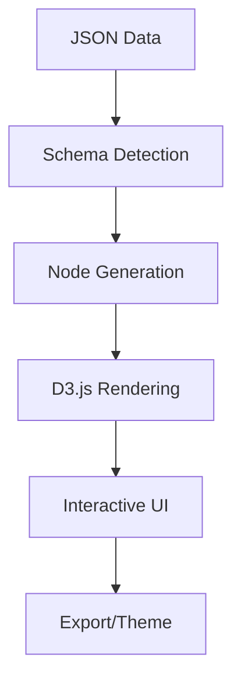
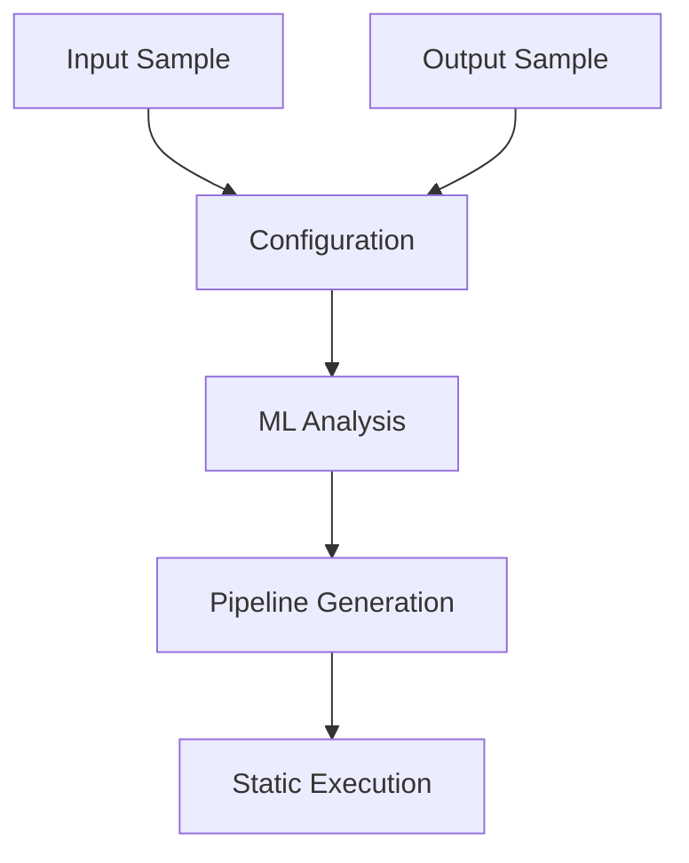

# NODEQ MindMap & Pipeline Builder 🧠⚡

[](https://www.npmjs.com/package/nodeq-mindmap)
[](https://opensource.org/licenses/MIT)
[](https://github.com/workflow-builder/nodeq-mindmap)

A lightweight library that combines **interactive mind map visualization** with **intelligent data pipeline building**. Transform JSON data into beautiful mind maps AND create ML-powered data transformation pipelines.

## 🏗️ Architecture Overview

<div style="display: flex; gap: 20px; flex-wrap: wrap;">

<div style="flex: 1; min-width: 400px;">

### Mind Map Visualization



</div>

<div style="flex: 1; min-width: 400px;">

### Pipeline Processor



</div>

</div>

## 📦 Installation

```bash
npm install nodeq-mindmap
```

## 🚀 Quick Start

### Basic Mind Map

```javascript
import { NodeQMindMap } from 'nodeq-mindmap';

const data = {
  "topic": "My Project",
  "children": [
    {
      "topic": "Frontend",
      "skills": ["React", "TypeScript", "CSS"]
    },
    {
      "topic": "Backend", 
      "skills": ["Node.js", "Express", "PostgreSQL"]
    }
  ]
};

const mindMap = new NodeQMindMap({
  container: '#mindmap-container',
  data: data,
  width: 800,
  height: 600
});

mindMap.render();
```

### Smart Data Pipeline

```javascript
// Define input/output samples
const inputSample = {
  "firstName": "John",
  "lastName": "Doe", 
  "age": 25
};

const outputSample = {
  "fullName": "John Doe",
  "isAdult": true
};

// AI creates transformation pipeline
const pipeline = await mindMap.createDataPipeline(
  'User Transform',
  inputSample, 
  outputSample
);

// Execute with new data (fast static execution)
const result = mindMap.executePipeline({
  "firstName": "Jane",
  "lastName": "Smith",
  "age": 17
});
// Result: { "fullName": "Jane Smith", "isAdult": false }
```

## 📋 Core API Methods

### Mind Map Methods
```javascript
const mindMap = new NodeQMindMap(config);

// Basic operations
mindMap.render();                    // Render the mind map
mindMap.updateData(newData);         // Update with new data
mindMap.updateTheme(themeOptions);   // Change theme
mindMap.exportSVG();                 // Export as SVG string
mindMap.destroy();                   // Clean up resources

// Interactive features
mindMap.expandAll();                 // Expand all nodes
mindMap.collapseAll();              // Collapse all nodes
mindMap.zoomToFit();                // Auto-zoom to content
mindMap.centerMap();                // Center the view
```

### Pipeline Methods
```javascript
// Pipeline creation and management
await mindMap.createDataPipeline(name, inputSample, outputSample, options);
await mindMap.updatePipelineInput(newInputSample);
await mindMap.updatePipelineOutput(newOutputSample);
mindMap.executePipeline(inputData);

// Pipeline utilities
mindMap.getAllPipelines();          // Get all pipelines
mindMap.switchToPipeline(pipelineId);  // Switch active pipeline
mindMap.exportPipelineCode();       // Generate executable code
mindMap.getPipelineEngine();        // Access engine directly
```

### Configuration Options
```javascript
const config = {
  container: '#mindmap-container',   // Required: DOM selector
  data: jsonData,                   // Required: JSON data
  width: 800,                       // Optional: Canvas width
  height: 600,                      // Optional: Canvas height

  // Styling
  theme: {
    nodeColor: '#4299e1',          // Node background
    textColor: '#2d3748',          // Text color
    linkColor: '#a0aec0',          // Connection lines
    backgroundColor: '#ffffff',     // Canvas background
    fontSize: 14,                  // Text size
    fontFamily: 'Arial, sans-serif'
  },

  // Behavior
  interactive: true,               // Enable interactions
  zoomable: true,                 // Enable zoom/pan
  collapsible: true,              // Enable node collapse

  // Callbacks
  onNodeClick: (node) => { /* handle click */ },
  onNodeHover: (node) => { /* handle hover */ },
  onPipelineCreated: (pipeline) => { /* handle creation */ },
  onDataTransformed: (result) => { /* handle transformation */ }
};
```

## 🎨 Built-in Themes

```javascript
// Apply theme presets
const themes = ['default', 'dark', 'forest', 'ocean'];

mindMap.updateTheme({
  nodeColor: '#4299e1',      // Node background
  textColor: '#2d3748',      // Text color  
  linkColor: '#a0aec0',      // Connection lines
  backgroundColor: '#ffffff' // Canvas background
});
```

## 🖥️ CLI Usage

```bash
# Generate mind map from JSON
nodeq-mindmap generate --input data.json --output mindmap.svg

# Create data pipeline
nodeq-mindmap pipeline create \
  --input sample-input.json \
  --output sample-output.json \
  --name "My Pipeline"

# Execute pipeline
nodeq-mindmap pipeline execute \
  --name "My Pipeline" \
  --input new-data.json
```

## 📚 Complete Documentation

| 📖 Guide | 📝 Description |
|----------|----------------|
| **[Installation Guide](docs/INSTALLATION.md)** | Complete setup, configuration, and framework integration |
| **[Pipeline Guide](docs/PIPELINE_GUIDE.md)** | ML-powered data transformation and ETL replacement |
| **[CLI Guide](docs/CLI_GUIDE.md)** | Command-line interface and headless operations |
| **[Use Cases](docs/USE_CASES.md)** | Real-world examples and industry applications |
| **[API Reference](docs/API_REFERENCE.md)** | Complete API documentation and TypeScript types |
| **[Architecture](docs/ARCHITECTURE.md)** | System design and technical details |

## 🌟 Key Features

### 🗺️ Interactive Mind Maps
- ✅ **Universal JSON Support** - Convert any JSON to mind maps
- ✅ **Interactive Navigation** - Click, zoom, pan, expand/collapse
- ✅ **Responsive Design** - Works on all devices
- ✅ **Custom Themes** - Full styling control
- ✅ **Framework Agnostic** - React, Vue, Angular, vanilla JS

### ⚡ Intelligent Pipeline Builder
- 🧠 **AI-Generated Pipelines** - Upload samples, get transformation logic
- 🔧 **Multiple ML Models** - TensorFlow.js, Hugging Face, OpenAI, custom
- 🔌 **Real-time Sources** - IoT Hub, Kafka, APIs, WebSockets, MQTT
- 📊 **Performance Monitoring** - Throughput, latency, error tracking
- 💻 **Code Generation** - Export production-ready functions

## 🚀 Deploy on Replit

Deploy your pipeline-powered application on Replit:

1. **Import Project**: Upload your NodeQ project to Replit
2. **Install Dependencies**: Run `npm install` 
3. **Configure Port**: Use port 5000 for web applications
4. **Deploy**: Use Replit's deployment feature to publish your app

```javascript
// Replit-ready server configuration
const server = app.listen(5000, '0.0.0.0', () => {
  console.log('Mind Map app running on port 5000');
});
```

## 📄 License

MIT License - see [LICENSE](LICENSE) file for details.

## 📞 Support & Community

- 🌐 **Website**: [nodeq.cloud](https://nodeq.cloud/)
- 🐛 **Issues**: [GitHub Issues](https://github.com/workflow-builder/nodeq-mindmap/issues)  
- 💬 **Discussions**: [GitHub Discussions](https://github.com/orgs/workflow-builder/discussions)
- 🚀 **Deploy**: [Replit](https://replit.com)

---

**Transform your data with intelligence. Visualize your pipelines with clarity.**

Made with ❤️ by the NODEQ Team