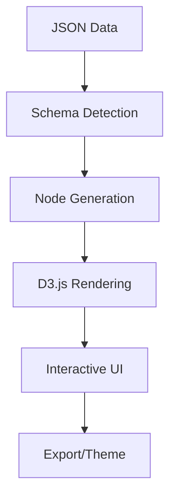
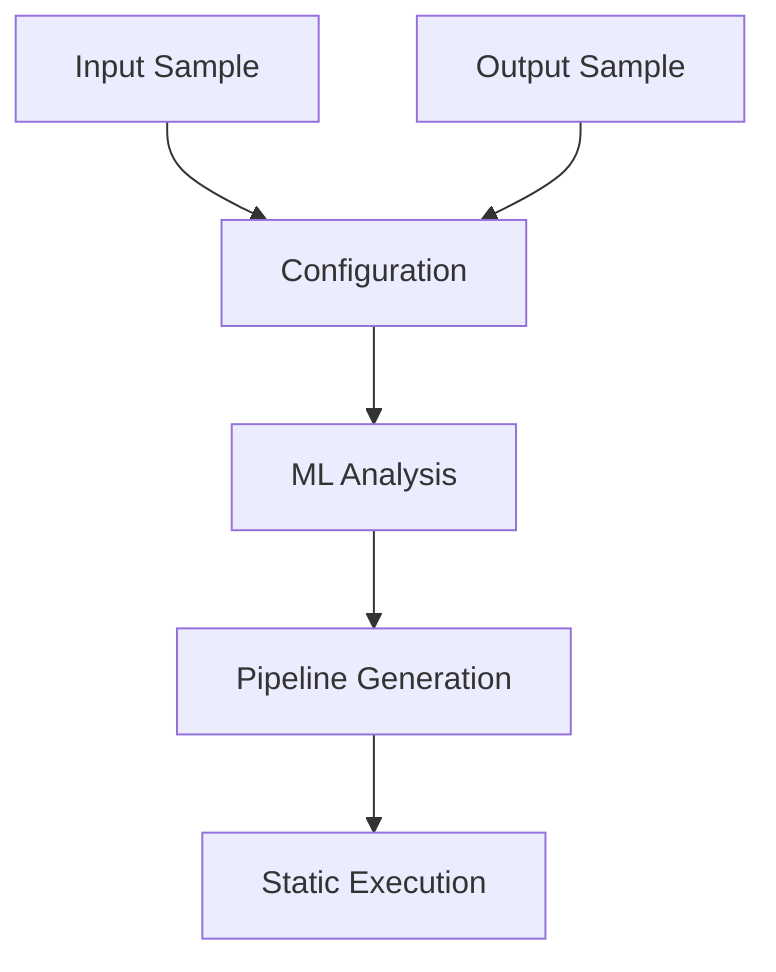

# NODEQ MindMap & Pipeline Builder 🧠⚡

[](https://www.npmjs.com/package/nodeq-mindmap)
[](https://opensource.org/licenses/MIT)
[](https://github.com/workflow-builder/nodeq-mindmap)

A revolutionary lightweight library that combines **interactive mind map visualization** with **intelligent data pipeline building**. Transform JSON data into beautiful mind maps AND create ML-powered data transformation pipelines.

## 🏗️ Architecture Overview

<div style="display: flex; gap: 20px; flex-wrap: wrap;">

<div style="flex: 1; min-width: 400px;">

### Mind Map Visualization



</div>

<div style="flex: 1; min-width: 400px;">

### Pipeline Processor



</div>

</div>

## 📦 Installation

```bash
npm install nodeq-mindmap
```

## 🚀 Quick Start

### Basic Mind Map

```javascript
import { NodeQMindMap } from 'nodeq-mindmap';

const data = {
  "topic": "My Project",
  "children": [
    { "topic": "Frontend", "skills": ["React", "TypeScript"] },
    { "topic": "Backend", "skills": ["Node.js", "PostgreSQL"] }
  ]
};

const mindMap = new NodeQMindMap({
  container: '#mindmap-container',
  data: data,
  width: 800,
  height: 600
});

mindMap.render();
```

### Smart Data Pipeline

```javascript
// Define input/output samples - AI creates transformation
const inputSample = { "firstName": "John", "lastName": "Doe", "age": 25 };
const outputSample = { "fullName": "John Doe", "isAdult": true };

const pipeline = await mindMap.createDataPipeline(
  'User Transform',
  inputSample, 
  outputSample
);

// Execute with new data (fast static execution)
const result = mindMap.executePipeline({
  "firstName": "Jane", "lastName": "Smith", "age": 17
});
// Result: { "fullName": "Jane Smith", "isAdult": false }
```

## 📋 Core API Methods

### Mind Map Methods
```javascript
const mindMap = new NodeQMindMap(config);

// Rendering
mindMap.render();                    // Render the mind map
mindMap.updateData(newData);         // Update with new data
mindMap.destroy();                   // Clean up resources

// Styling
mindMap.updateTheme(themeOptions);   // Change theme
mindMap.exportSVG();                 // Export as SVG

// Navigation
mindMap.expandAll();                 // Expand all nodes
mindMap.collapseAll();              // Collapse all nodes
mindMap.zoomToFit();                // Auto-zoom to content
mindMap.centerMap();                // Center the view
```

### Pipeline Methods
```javascript
// Pipeline operations
await mindMap.createDataPipeline(name, inputSample, outputSample, options);
mindMap.executePipeline(inputData);  // Fast static execution
mindMap.exportPipelineCode();        // Generate executable code

// Management
mindMap.getAllPipelines();           // Get all pipelines
mindMap.switchToPipeline(pipelineId); // Switch active pipeline
mindMap.getPipelineEngine();         // Access engine directly
```

### Configuration Options
```javascript
const config = {
  container: '#mindmap-container',   // Required: DOM selector
  data: jsonData,                   // Required: JSON data
  width: 800,                       // Canvas width
  height: 600,                      // Canvas height

  // Styling
  theme: {
    nodeColor: '#4299e1',          // Node background
    textColor: '#2d3748',          // Text color
    linkColor: '#a0aec0',          // Connection lines
    backgroundColor: '#ffffff'     // Canvas background
  },

  // Behavior
  interactive: true,               // Enable interactions
  zoomable: true,                 // Enable zoom/pan
  collapsible: true,              // Enable node collapse

  // Callbacks
  onNodeClick: (node) => { /* handle click */ },
  onPipelineCreated: (pipeline) => { /* handle creation */ }
};
```

## ✨ Key Features

- 🗺️ **Interactive Mind Maps** - Convert any JSON to visual mind maps
- ⚡ **AI-Powered Pipelines** - Upload samples, get transformation logic  
- 🧠 **ML Models** - TensorFlow.js, Hugging Face, OpenAI integration
- 🔌 **Real-time Sources** - IoT, Kafka, REST APIs, WebSockets
- 💻 **CLI Support** - Headless rendering and automation
- 🎨 **Framework Agnostic** - Works with React, Vue, Angular, vanilla JS

## 📚 Complete Documentation

| 📖 Guide | 📝 Description |
|----------|----------------|
| **[Installation & Setup](docs/INSTALLATION.md)** | Complete setup, configuration, and framework integration |
| **[Pipeline Builder Guide](docs/PIPELINE_GUIDE.md)** | ML-powered data transformation and ETL automation |
| **[CLI Usage](docs/CLI_GUIDE.md)** | Command-line interface and headless operations |
| **[Real-World Use Cases](docs/USE_CASES.md)** | Industry examples and implementation patterns |
| **[API Reference](docs/API_REFERENCE.md)** | Complete API documentation and TypeScript types |
| **[Framework Integration](docs/FRAMEWORK_INTEGRATION.md)** | React, Vue, Angular integration examples |
| **[Data Sources](docs/DATA_SOURCES.md)** | IoT, Kafka, API, and database integrations |
| **[System Architecture](docs/ARCHITECTURE.md)** | Technical architecture and design patterns |

## 🛠️ CLI Usage

```bash
# Generate mind map from JSON
nodeq-mindmap generate --input data.json --output mindmap.svg

# Create data pipeline
nodeq-mindmap pipeline create \
  --input sample-input.json \
  --output sample-output.json \
  --name "My Pipeline"

# Execute pipeline
nodeq-mindmap pipeline execute \
  --name "My Pipeline" \
  --input new-data.json
```

## 🎨 Built-in Themes

```javascript
// Theme presets: 'default', 'dark', 'forest', 'ocean'
mindMap.updateTheme({
  nodeColor: '#4299e1',
  textColor: '#2d3748',
  backgroundColor: '#ffffff'
});
```

## 🚀 What's New in v2.1.0

✨ **Enhanced Pipeline Engine** with ML-powered transformation  
🧠 **Configurable ML Models** (TensorFlow.js, Hugging Face, OpenAI)  
🔌 **Real-time Data Sources** (IoT Hub, Kafka, REST APIs, WebSockets)  
⚡ **ETL Process Automation** replacing traditional ETL workflows  
📊 **Performance Monitoring** with built-in metrics  

## 📊 Performance

- **Bundle Size**: 25.5 kB optimized
- **Processing**: <50ms pipeline execution
- **Compatibility**: Node.js 16+, modern browsers

## 📄 License

MIT License - see [LICENSE](LICENSE) file for details.

## 📞 Support

- 🌐 **Website**: [nodeq.cloud](https://nodeq.cloud/)
- 🐛 **Issues**: [GitHub Issues](https://github.com/workflow-builder/nodeq-mindmap/issues)  
- 💬 **Community**: [GitHub Discussions](https://github.com/orgs/workflow-builder/discussions)

---

**Transform your data with intelligence. Visualize your pipelines with clarity.**

Made with ❤️ by the NODEQ Team