# NODEQ MindMap & Pipeline Builder 🧠⚡

[](https://www.npmjs.com/package/nodeq-mindmap)
[](https://opensource.org/licenses/MIT)
[](https://github.com/workflow-builder/nodeq-mindmap)

A revolutionary lightweight library that combines **interactive mind map visualization** with **intelligent data pipeline building**. Transform JSON data into beautiful mind maps AND create ML-powered data transformation pipelines through simple configuration.

## 🏗️ System Architecture Overview

### Mind Map Visualization Architecture

```mermaid
flowchart TB
    subgraph "📄 Data Input"
        A[JSON Data]
        B[Nested Objects]
        C[Arrays & Lists]
    end

    subgraph "🔄 Processing Engine"
        D[Schema Detection]
        E[Node Generation]
        F[Hierarchy Mapping]
        G[Layout Calculation]
    end

    subgraph "🎨 Visualization Layer"
        H[D3.js Rendering]
        I[Interactive Nodes]
        J[Zoom & Pan]
        K[Theme System]
    end

    subgraph "👥 User Interaction"
        L[Click Events]
        M[Hover Effects]
        N[Expand/Collapse]
        O[Export Options]
    end

    A --> D
    B --> D
    C --> D
    D --> E
    E --> F
    F --> G
    G --> H
    H --> I
    I --> J
    J --> K
    K --> L
    L --> M
    M --> N
    N --> O

    classDef input fill:#e3f2fd
    classDef processing fill:#f3e5f5
    classDef visual fill:#e8f5e8
    classDef interaction fill:#fff3e0

    class A,B,C input
    class D,E,F,G processing
    class H,I,J,K visual
    class L,M,N,O interaction
```



### Data Pipeline Processor Architecture

```mermaid
flowchart TB
    subgraph "📥 Input Sources"
        A[IoT Sensors]
        B[REST APIs]
        C[Kafka Streams]
        D[Databases]
        E[WebSockets]
    end

    subgraph "🧠 ML Analysis Engine"
        F[Pattern Recognition]
        G[Schema Mapping]
        H[Rule Generation]
        I[Transformation Logic]
    end

    subgraph "⚡ Pipeline Engine"
        J[Data Validation]
        K[Static Execution]
        L[Error Handling]
        M[Performance Monitoring]
    end

    subgraph "📤 Output Destinations"
        N[Analytics DB]
        O[Real-time Dashboard]
        P[Alert Systems]
        Q[ML Training Data]
    end

    A -.->|Stream| F
    B -.->|Poll| F
    C -.->|Subscribe| F
    D -.->|CDC| F
    E -.->|Live| F

    F --> G
    G --> H
    H --> I
    I --> J
    J --> K
    K --> L
    L --> M

    M --> N
    M --> O
    M --> P
    M --> Q

    classDef sources fill:#ffebee
    classDef ml fill:#e8eaf6
    classDef pipeline fill:#e0f2f1
    classDef outputs fill:#fafafa

    class A,B,C,D,E sources
    class F,G,H,I ml
    class J,K,L,M pipeline
    class N,O,P,Q outputs
```



## 🚀 What's New in v2.1.0

✨ **Enhanced Pipeline Engine** with ML-powered data transformation  
🧠 **Configurable ML Models** (TensorFlow.js, Hugging Face, OpenAI)  
🔌 **Real-time Data Sources** (IoT Hub, Kafka, REST APIs, WebSockets)  
🖥️ **CLI Support** with headless rendering capabilities  
⚡ **ETL Process Automation** replacing traditional ETL workflows  
📊 **Performance Monitoring** with real-time metrics  

## 🎯 Quick Start

### 📦 Installation

```bash
npm install nodeq-mindmap
```

### 🗺️ Basic Mind Map

```javascript
import { NodeQMindMap } from 'nodeq-mindmap';

const data = {
  "topic": "My Project",
  "children": [
    {
      "topic": "Frontend",
      "skills": ["React", "TypeScript", "CSS"]
    },
    {
      "topic": "Backend", 
      "skills": ["Node.js", "Express", "PostgreSQL"]
    }
  ]
};

const mindMap = new NodeQMindMap({
  container: '#mindmap-container',
  data: data,
  width: 800,
  height: 600
});

mindMap.render();
```

### ⚡ Smart Data Pipeline

```javascript
// Define input/output samples
const inputSample = {
  "firstName": "John",
  "lastName": "Doe", 
  "age": 25
};

const outputSample = {
  "fullName": "John Doe",
  "isAdult": true
};

// AI creates transformation pipeline
const pipeline = await mindMap.createDataPipeline(
  'User Transform',
  inputSample, 
  outputSample
);

// Execute with new data (fast static execution)
const result = mindMap.executePipeline({
  "firstName": "Jane",
  "lastName": "Smith",
  "age": 17
});
// Result: { "fullName": "Jane Smith", "isAdult": false }
```

## 📋 Core API Methods

### Mind Map Methods
```javascript
const mindMap = new NodeQMindMap(config);

// Basic operations
mindMap.render();                    // Render the mind map
mindMap.updateData(newData);         // Update with new data
mindMap.updateTheme(themeOptions);   // Change theme
mindMap.exportSVG();                 // Export as SVG string
mindMap.destroy();                   // Clean up resources

// Interactive features
mindMap.expandAll();                 // Expand all nodes
mindMap.collapseAll();              // Collapse all nodes
mindMap.zoomToFit();                // Auto-zoom to content
mindMap.centerMap();                // Center the view
```

### Pipeline Methods
```javascript
// Pipeline creation and management
await mindMap.createDataPipeline(name, inputSample, outputSample, options);
await mindMap.updatePipelineInput(newInputSample);
await mindMap.updatePipelineOutput(newOutputSample);
mindMap.executePipeline(inputData);

// Pipeline utilities
mindMap.getAllPipelines();          // Get all pipelines
mindMap.switchToPipeline(pipelineId);  // Switch active pipeline
mindMap.exportPipelineCode();       // Generate executable code
mindMap.getPipelineEngine();        // Access engine directly
```

### Configuration Options
```javascript
const config = {
  container: '#mindmap-container',   // Required: DOM selector
  data: jsonData,                   // Required: JSON data
  width: 800,                       // Optional: Canvas width
  height: 600,                      // Optional: Canvas height
  
  // Styling
  theme: {
    nodeColor: '#4299e1',          // Node background
    textColor: '#2d3748',          // Text color
    linkColor: '#a0aec0',          // Connection lines
    backgroundColor: '#ffffff',     // Canvas background
    fontSize: 14,                  // Text size
    fontFamily: 'Arial, sans-serif'
  },
  
  // Behavior
  interactive: true,               // Enable interactions
  zoomable: true,                 // Enable zoom/pan
  collapsible: true,              // Enable node collapse
  
  // Callbacks
  onNodeClick: (node) => { /* handle click */ },
  onNodeHover: (node) => { /* handle hover */ },
  onPipelineCreated: (pipeline) => { /* handle creation */ },
  onDataTransformed: (result) => { /* handle transformation */ }
};
```

## 📋 Quick Reference

### Essential Methods
```javascript
// Basic Usage
const mindMap = new NodeQMindMap({ container: '#container', data: myData });
mindMap.render();

// Data Operations
mindMap.updateData(newData);
mindMap.exportSVG();

// Pipeline Operations
await mindMap.createDataPipeline('MyPipeline', inputSample, outputSample);
const result = mindMap.executePipeline(newData);

// Theme Updates
mindMap.updateTheme({ nodeColor: '#ff6b6b', backgroundColor: '#f8f9fa' });
```

### Built-in Themes
```javascript
// Available theme presets
const themes = ['default', 'dark', 'forest', 'ocean'];

// Apply theme
mindMap.updateTheme({
  nodeColor: '#4299e1',      // Node background
  textColor: '#2d3748',      // Text color  
  linkColor: '#a0aec0',      // Connection lines
  backgroundColor: '#ffffff' // Canvas background
});
```

## 📚 Complete Documentation

| 📖 Guide | 📝 Description |
|----------|----------------|
| **[Installation Guide](docs/INSTALLATION.md)** | Complete setup, configuration, and framework integration |
| **[Pipeline Guide](docs/PIPELINE_GUIDE.md)** | ML-powered data transformation and ETL replacement |
| **[CLI Guide](docs/CLI_GUIDE.md)** | Command-line interface and headless operations |
| **[Use Cases](docs/USE_CASES.md)** | Real-world examples and industry applications |
| **[API Reference](docs/API_REFERENCE.md)** | Complete API documentation and TypeScript types |

## 🌟 Key Features

### 🗺️ Interactive Mind Maps
- ✅ **Universal JSON Support** - Convert any JSON to mind maps
- ✅ **Interactive Navigation** - Click, zoom, pan, expand/collapse
- ✅ **Responsive Design** - Works on all devices
- ✅ **Custom Themes** - Full styling control
- ✅ **Framework Agnostic** - React, Vue, Angular, vanilla JS

### ⚡ Intelligent Pipeline Builder
- 🧠 **AI-Generated Pipelines** - Upload samples, get transformation logic
- 🔧 **Multiple ML Models** - TensorFlow.js, Hugging Face, OpenAI, custom
- 🔌 **Real-time Sources** - IoT Hub, Kafka, APIs, WebSockets, MQTT
- 📊 **Performance Monitoring** - Throughput, latency, error tracking
- 💻 **Code Generation** - Export production-ready functions

### 🔄 ETL Process Revolution
**Traditional ETL**: Weeks to Months | High Maintenance | Low Flexibility  
**NodeQ Smart Pipeline**: Minutes to Hours | Low Maintenance | High Flexibility

| Traditional ETL | NodeQ Smart Pipeline |
|----------------|---------------------|
| Manual code for each source | AI-generated transformations |
| Weeks of development | Minutes to deploy |
| High maintenance overhead | Auto-adapting pipelines |
| Custom monitoring setup | Built-in performance metrics |

## 🎨 Framework Integration Examples

### React Integration
```jsx
import React, { useEffect, useRef } from 'react';
import { NodeQMindMap } from 'nodeq-mindmap';

const MindMapComponent = ({ data }) => {
  const containerRef = useRef(null);
  const mindMapRef = useRef(null);

  useEffect(() => {
    if (containerRef.current) {
      mindMapRef.current = new NodeQMindMap({
        container: containerRef.current,
        data: data,
        width: 800,
        height: 600,
        theme: { 
          nodeColor: '#4299e1',
          backgroundColor: '#f7fafc' 
        },
        onNodeClick: (node) => {
          console.log('Clicked:', node.topic);
        }
      });
      mindMapRef.current.render();
    }

    return () => {
      if (mindMapRef.current) {
        mindMapRef.current.destroy();
      }
    };
  }, [data]);

  return <div ref={containerRef} style={{ width: '100%', height: '600px' }}></div>;
};

export default MindMapComponent;
```

### Vue.js Integration
```vue
<template>
  <div ref="mindmapContainer" class="mindmap-container"></div>
</template>

<script>
import { NodeQMindMap } from 'nodeq-mindmap';

export default {
  name: 'MindMapComponent',
  props: {
    data: {
      type: Object,
      required: true
    }
  },
  data() {
    return {
      mindMap: null
    };
  },
  mounted() {
    this.initializeMindMap();
  },
  beforeUnmount() {
    if (this.mindMap) {
      this.mindMap.destroy();
    }
  },
  methods: {
    initializeMindMap() {
      this.mindMap = new NodeQMindMap({
        container: this.$refs.mindmapContainer,
        data: this.data,
        width: 800,
        height: 600,
        interactive: true,
        onNodeClick: (node) => {
          this.$emit('node-clicked', node);
        }
      });
      this.mindMap.render();
    }
  }
};
</script>

<style scoped>
.mindmap-container {
  width: 100%;
  height: 600px;
  border: 1px solid #e2e8f0;
  border-radius: 8px;
}
</style>
```

### Angular Integration
```typescript
// mindmap.component.ts
import { Component, ElementRef, Input, OnInit, OnDestroy, ViewChild } from '@angular/core';
import { NodeQMindMap } from 'nodeq-mindmap';

@Component({
  selector: 'app-mindmap',
  template: `<div #mindmapContainer class="mindmap-container"></div>`,
  styleUrls: ['./mindmap.component.css']
})
export class MindMapComponent implements OnInit, OnDestroy {
  @ViewChild('mindmapContainer', { static: true }) container!: ElementRef;
  @Input() data: any;
  
  private mindMap: NodeQMindMap | null = null;

  ngOnInit() {
    this.mindMap = new NodeQMindMap({
      container: this.container.nativeElement,
      data: this.data,
      width: 800,
      height: 600,
      theme: {
        nodeColor: '#6366f1',
        backgroundColor: '#f8fafc'
      }
    });
    this.mindMap.render();
  }

  ngOnDestroy() {
    if (this.mindMap) {
      this.mindMap.destroy();
    }
  }
}
```

### Vanilla HTML/JavaScript
```html
<!DOCTYPE html>
<html lang="en">
<head>
    <meta charset="UTF-8">
    <meta name="viewport" content="width=device-width, initial-scale=1.0">
    <title>NodeQ MindMap Demo</title>
    <script src="https://unpkg.com/nodeq-mindmap@2.1.0/dist/index.umd.js"></script>
    <style>
        #mindmap-container {
            width: 100%;
            height: 600px;
            border: 2px solid #e2e8f0;
            border-radius: 12px;
            margin: 20px 0;
        }
    </style>
</head>
<body>
    <h1>My Mind Map</h1>
    <div id="mindmap-container"></div>
    
    <script>
        // Sample data
        const projectData = {
          "topic": "My Project",
          "summary": "Full-stack web application",
          "children": [
            {
              "topic": "Frontend",
              "skills": ["React", "TypeScript", "Tailwind CSS"],
              "children": [
                { "topic": "Components", "skills": ["Header", "Sidebar", "Dashboard"] },
                { "topic": "State Management", "skills": ["Redux", "Context API"] }
              ]
            },
            {
              "topic": "Backend", 
              "skills": ["Node.js", "Express", "PostgreSQL"],
              "children": [
                { "topic": "API Routes", "skills": ["/api/users", "/api/projects"] },
                { "topic": "Database", "skills": ["Users table", "Projects table"] }
              ]
            }
          ]
        };

        // Initialize mind map
        const mindMap = new NodeQMindMap({
            container: '#mindmap-container',
            data: projectData,
            width: 1000,
            height: 600,
            theme: {
                nodeColor: '#3b82f6',
                textColor: '#1f2937',
                backgroundColor: '#f8fafc'
            },
            interactive: true,
            zoomable: true,
            collapsible: true,
            onNodeClick: (node) => {
                alert(`Clicked: ${node.topic}`);
            },
            onNodeHover: (node) => {
                console.log(`Hovering: ${node.topic}`);
            }
        });

        // Render the mind map
        mindMap.render();
        
        // Example: Update data after 3 seconds
        setTimeout(() => {
            const newData = {
                ...projectData,
                topic: "Updated Project"
            };
            mindMap.updateData(newData);
        }, 3000);
    </script>
</body>
</html>
```

## 🛠️ CLI Usage

```bash
# Generate mind map from JSON
nodeq-mindmap generate --input data.json --output mindmap.svg

# Create data pipeline
nodeq-mindmap pipeline create \
  --input sample-input.json \
  --output sample-output.json \
  --name "My Pipeline"

# Execute pipeline
nodeq-mindmap pipeline execute \
  --name "My Pipeline" \
  --input new-data.json
```

## 🏭 Real-World Applications

### E-commerce Analytics
Transform order data from multiple sources into analytics-ready format with 95% faster development.

### Financial Risk Assessment  
Real-time market data processing for trading decisions with <50ms latency.

### IoT Manufacturing
Predictive maintenance from sensor data with 99.9% uptime.

### Healthcare Data Processing
HIPAA-compliant patient data transformation with automated validation.

[→ See all use cases](docs/USE_CASES.md)

## 🔧 Configuration & Themes

```javascript
const mindMap = new NodeQMindMap({
  container: '#mindmap',
  data: data,
  width: 1200,
  height: 800,
  theme: {
    nodeColor: '#6B46C1',    // Purple nodes
    textColor: '#1A202C',    // Dark text
    backgroundColor: '#F7FAFC' // Light background
  },
  layout: {
    algorithm: 'force',      // Force-directed layout
    nodeSpacing: 250
  },
  animation: {
    enabled: true,
    duration: 1000
  },
  onNodeClick: (node) => {
    console.log('Clicked:', node.topic);
  }
});
```

**Built-in Themes**: `default`, `dark`, `forest`, `ocean`

## 🚀 Deployment on Replit

1. **Create Repl**: Import your NodeQ project
2. **Install**: `npm install nodeq-mindmap`
3. **Configure**: Use port 5000 and `0.0.0.0` binding
4. **Deploy**: Use Replit's deployment feature

```javascript
// Replit-ready server configuration
const server = app.listen(5000, '0.0.0.0', () => {
  console.log('Mind Map app running on port 5000');
});
```

## 📊 Performance

- **Bundle Size**: 25.5 kB (optimized)
- **Load Time**: Fast initialization with lazy loading  
- **Memory**: Efficient D3.js rendering with cleanup
- **Compatibility**: Node.js 16+, modern browsers

## 🤝 Contributing

We welcome contributions! See our [Contributing Guide](CONTRIBUTING.md) for details.

1. Fork the repository
2. Create your feature branch
3. Make your changes with tests
4. Submit a pull request

## 📄 License

MIT License - see [LICENSE](LICENSE) file for details.

## 🙏 Acknowledgments

- Built with [D3.js](https://d3js.org/) for powerful visualization
- ML integration with [TensorFlow.js](https://www.tensorflow.org/js)
- Designed for the [Replit](https://replit.com) ecosystem

## 📞 Support & Community

- 🌐 **Website**: [nodeq.cloud](https://nodeq.cloud/)
- 🐛 **Issues**: [GitHub Issues](https://github.com/workflow-builder/nodeq-mindmap/issues)  
- 💬 **Discussions**: [GitHub Discussions](https://github.com/orgs/workflow-builder/discussions)
- 🚀 **Deploy**: [Replit](https://replit.com)

---

**Transform your data with intelligence. Visualize your pipelines with clarity.**

Made with ❤️ by the NODEQ Team

## ⚡ Quick Start - Data Pipeline Builder

### Creating Your First Pipeline

```javascript
import { NodeQMindMap } from 'nodeq-mindmap';

// Initialize the enhanced mind map with pipeline capabilities
const mindMap = new NodeQMindMap({
  container: '#mindmap-container',
  data: {},
  width: 1000,
  height: 600
});

// Sample input data structure
const inputSample = {
  "firstName": "John",
  "lastName": "Doe",
  "age": 25,
  "email": "john.doe@email.com"
};

// Sample output data structure
const outputSample = {
  "fullName": "John Doe",
  "isAdult": true,
  "contact": "john.doe@email.com"
};

// Create a data transformation pipeline
async function createPipeline() {
  try {
    const pipeline = await mindMap.createDataPipeline(
      'User Data Transformation', 
      inputSample, 
      outputSample
    );

    console.log(`Pipeline created with ${pipeline.transformationRules.length} rules`);
    console.log(`Accuracy: ${(pipeline.accuracy * 100).toFixed(1)}%`);

    // The mind map will automatically display the pipeline visualization
  } catch (error) {
    console.error('Pipeline creation failed:', error);
  }
}

createPipeline();
```

### Executing the Pipeline

```javascript
// Execute the pipeline with new data (uses compiled static logic)
const testData = {
  "firstName": "Jane",
  "lastName": "Smith", 
  "age": 17,
  "email": "jane.smith@email.com"
};

// This execution is FAST (1-5ms) - no ML model involved
const result = mindMap.executePipeline(testData);
console.log(result);
// Output: {
//   "fullName": "Jane Smith",
//   "isAdult": false,
//   "contact": "jane.smith@email.com"
// }

// Check execution mode
const executionMode = mindMap.getPipelineEngine().getPipelineExecutionMode(pipelineId);
console.log('Execution mode:', executionMode); // "static"

const isStatic = mindMap.getPipelineEngine().isPipelineStatic(pipelineId);
console.log('Uses static logic:', isStatic); // true
```

### Updating Pipeline Configuration

```javascript
// Update with new input format
const newInputSample = {
  "first_name": "Bob",
  "last_name": "Wilson",
  "birth_year": 1990,
  "email_address": "bob@example.com"
};

await mindMap.updatePipelineInput(newInputSample);

// Update with new output format
const newOutputSample = {
  "name": "Bob Wilson",
  "age": 33,
  "email": "bob@example.com"
};

await mindMap.updatePipelineOutput(newOutputSample);
```

### Generating Pipeline Code

```javascript
// Export the pipeline as executable code
const generatedCode = mindMap.exportPipelineCode();
console.log(generatedCode);

// Example output:
// function transformData(inputData) {
//   const result = {};
//   
//   // map transformation: firstName -> fullName
//   result.fullName = inputData.firstName + ' ' + inputData.lastName;
//   
//   // custom transformation: age -> isAdult
//   result.isAdult = Number(inputData.age) >= 18;
//   
//   // map transformation: email -> contact
//   result.contact = inputData.email;
//   
//   return result;
// }
```

## 🧠 Configurable ML Models

### Using Different ML Models

#### 1. Built-in TensorFlow Model (Default)
```javascript
const mindMap = new NodeQMindMap({
  container: '#mindmap-container',
  data: {},
  width: 1000,
  height: 600
});

// Uses built-in TensorFlow.js model
const pipeline = await mindMap.createDataPipeline(
  'Default Pipeline',
  inputSample,
  outputSample
);
```

#### 2. Custom TensorFlow Model
```javascript
const customModelConfig = {
  type: 'tensorflow',
  localPath: './models/custom-pipeline-model/model.json',
  parameters: {
    threshold: 0.8
  }
};

const pipeline = await mindMap.createDataPipeline(
  'Custom TF Pipeline',
  inputSample,
  outputSample,
  { modelConfig: customModelConfig }
);
```

#### 3. Hugging Face Model Integration
```javascript
const hfModelConfig = {
  type: 'huggingface',
  modelName: 'sentence-transformers/all-MiniLM-L6-v2',
  endpoint: 'https://api-inference.huggingface.co/models/',
  apiKey: process.env.HF_API_TOKEN
};

const pipeline = await mindMap.createDataPipeline(
  'HF Semantic Pipeline',
  inputSample,
  outputSample,
  { modelConfig: hfModelConfig }
);
```

#### 4. OpenAI GPT Integration
```javascript
const openaiConfig = {
  type: 'openai',
  modelName: 'gpt-4',
  apiKey: process.env.OPENAI_API_KEY,
  parameters: {
    temperature: 0.2,
    maxTokens: 1000
  }
};

const pipeline = await mindMap.createDataPipeline(
  'GPT-Powered Pipeline',
  inputSample,
  outputSample,
  { modelConfig: openaiConfig }
);
```

#### 5. Custom API Model
```javascript
const customApiConfig = {
  type: 'custom',
  endpoint: 'https://your-ml-api.com/analyze',
  apiKey: process.env.CUSTOM_API_KEY,
  parameters: {
    analysisType: 'pipeline-generation',
    confidence: 0.9
  }
};

const pipeline = await mindMap.createDataPipeline(
  'Custom API Pipeline',
  inputSample,
  outputSample,
  { modelConfig: customApiConfig }
);
```

## 🔧 Configuration Options

### Basic Configuration

```javascript
const config = {
  container: '#mindmap-container',    // CSS selector for container element
  data: jsonData,                     // Your JSON data object
  width: 800,                         // Canvas width in pixels
  height: 600,                        // Canvas height in pixels

  // Core behavior
  interactive: true,                  // Enable click interactions
  zoomable: true,                    // Enable zoom and pan
  collapsible: true,                 // Enable node expand/collapse

  // Styling theme
  theme: {
    nodeColor: '#4299e1',            // Default node background color
    textColor: '#2d3748',            // Text color
    linkColor: '#a0aec0',            // Connection line color
    backgroundColor: '#ffffff',       // Canvas background color
    fontSize: 14,                     // Font size in pixels
    fontFamily: 'Arial, sans-serif', // Font family
    nodeRadius: 6,                   // Node border radius
    nodeOpacity: 0.9,               // Node opacity (0-1)
    linkOpacity: 0.7,               // Link opacity (0-1)
    hoverColor: '#2b6cb0'           // Node hover color
  },

  // Layout configuration
  layout: {
    nodeSpacing: 200,                // Horizontal space between nodes
    levelSpacing: 300,               // Vertical space between levels
    rootX: 400,                      // Root node X position
    rootY: 300,                      // Root node Y position
    algorithm: 'tree'                // Layout algorithm: 'tree', 'force', 'radial'
  },

  // Animation settings
  animation: {
    enabled: true,                   // Enable animations
    duration: 750,                   // Animation duration in ms
    easing: 'ease-in-out'           // CSS easing function
  },

  // Pipeline features (Enhanced in v2.0+)
  pipelineMode: false,               // Enable data pipeline features
  headlessMode: false,               // Enable headless rendering (CLI)

  // Event callbacks
  onNodeClick: (node, event) => {    // Node click handler
    console.log('Clicked node:', node);
  },
  onNodeHover: (node, event) => {    // Node hover handler
    console.log('Hovered node:', node);
  },
  onPipelineCreated: (pipeline) => { // Pipeline creation callback
    console.log('Pipeline created:', pipeline);
  },
  onDataTransformed: (result) => {   // Data transformation callback
    console.log('Data transformed:', result);
  },
  onRender: () => {                  // Render complete callback
    console.log('Mind map rendered');
  }
};

const mindMap = new NodeQMindMap(config);
```

### Theme Presets

```javascript
// Built-in theme presets
const themes = {
  default: {
    nodeColor: '#4299e1',
    textColor: '#2d3748',
    linkColor: '#a0aec0',
    backgroundColor: '#ffffff'
  },
  dark: {
    nodeColor: '#2d3748',
    textColor: '#f7fafc',
    linkColor: '#4a5568',
    backgroundColor: '#1a202c'
  },
  forest: {
    nodeColor: '#38a169',
    textColor: '#1a202c',
    linkColor: '#68d391',
    backgroundColor: '#f0fff4'
  },
  ocean: {
    nodeColor: '#3182ce',
    textColor: '#ffffff',
    linkColor: '#63b3ed',
    backgroundColor: '#ebf8ff'
  }
};

// Apply a preset theme
const mindMap = new NodeQMindMap({
  container: '#mindmap',
  data: myData,
  theme: themes.dark
});
```

## 🔌 Data Source Integrations

### Real-World Integration Examples

#### 1. IoT Hub Integration


```javascript
const iotConfig = {
  type: 'iot-hub',
  connection: {
    host: 'your-iot-hub.azure-devices.net',
    credentials: {
      token: process.env.IOT_HUB_TOKEN
    }
  },
  polling: {
    interval: 1000,
    batchSize: 100
  }
};

const pipeline = await mindMap.createDataPipeline(
  'IoT Sensor Pipeline',
  {
    deviceId: 'sensor_001',
    temperature: 23.5,
    humidity: 45.2,
    timestamp: '2024-01-15T10:30:00Z'
  },
  {
    device: 'sensor_001',
    readings: {
      temp_celsius: 23.5,
      humidity_percent: 45.2
    },
    alert_level: 'normal',
    processed_at: '2024-01-15T10:30:01Z'
  },
  {
    dataSources: [iotConfig],
    etlOptions: {
      errorHandling: 'log',
      parallelProcessing: true
    }
  }
);

// Start real-time processing
await mindMap.startRealtimeProcessing();
```

#### 2. Kafka Stream Processing


```javascript
const kafkaConfig = {
  type: 'kafka',
  connection: {
    host: 'localhost:9092',
    topic: 'user-events',
    credentials: {
      username: process.env.KAFKA_USERNAME,
      password: process.env.KAFKA_PASSWORD
    }
  },
  polling: {
    interval: 500,
    batchSize: 1000
  }
};

const pipeline = await mindMap.createDataPipeline(
  'User Event Stream',
  {
    userId: '12345',
    event: 'page_view',
    url: '/dashboard',
    timestamp: '2024-01-15T10:30:00Z',
    metadata: { browser: 'chrome', device: 'mobile' }
  },
  {
    user_id: '12345',
    action: 'page_view',
    page: '/dashboard',
    session_data: {
      browser: 'chrome',
      device_type: 'mobile',
      engagement_score: 0.75
    },
    processed_timestamp: '2024-01-15T10:30:01Z'
  },
  {
    dataSources: [kafkaConfig],
    modelConfig: { type: 'tensorflow' }
  }
);
```

#### 3. REST API Integration


```javascript
const apiConfig = {
  type: 'rest-api',
  connection: {
    apiEndpoint: 'https://api.example.com/data',
    credentials: {
      token: 'Bearer ' + process.env.API_TOKEN
    }
  },
  polling: {
    interval: 30000, // Poll every 30 seconds
    batchSize: 50
  }
};

const pipeline = await mindMap.createDataPipeline(
  'External API Integration',
  {
    id: 1,
    name: 'John Doe',
    email: 'john@example.com',
    created_at: '2024-01-15T10:30:00Z'
  },
  {
    customer_id: 1,
    full_name: 'John Doe',
    contact_email: 'john@example.com',
    status: 'active',
    last_sync: '2024-01-15T10:30:01Z'
  },
  { dataSources: [apiConfig] }
);
```

#### 4. Database Change Streams


```javascript
const dbConfig = {
  type: 'database',
  connection: {
    connectionString: process.env.DATABASE_URL,
    credentials: {
      username: process.env.DB_USERNAME,
      password: process.env.DB_PASSWORD
    }
  }
};

const pipeline = await mindMap.createDataPipeline(
  'Database CDC Pipeline',
  {
    operation: 'INSERT',
    table: 'users',
    data: {
      id: 123,
      email: 'new@example.com',
      created_at: '2024-01-15T10:30:00Z'
    }
  },
  {
    change_type: 'user_created',
    user_id: 123,
    email: 'new@example.com',
    should_send_welcome: true,
    index_for_search: true,
    created_timestamp: '2024-01-15T10:30:00Z'
  },
  { dataSources: [dbConfig] }
);
```

#### 5. WebSocket Real-time Data


```javascript
const wsConfig = {
  type: 'websocket',
  connection: {
    host: 'wss://api.example.com/stream',
    credentials: {
      token: process.env.WS_TOKEN
    }
  }
};

const pipeline = await mindMap.createDataPipeline(
  'Live Trading Data',
  {
    symbol: 'BTC/USD',
    price: 45000.50,
    volume: 1.25,
    timestamp: '2024-01-15T10:30:00.123Z'
  },
  {
    trading_pair: 'BTC/USD',
    current_price: 45000.50,
    volume_24h: 1.25,
    price_change_percent: 2.5,
    trend: 'bullish',
    last_updated: '2024-01-15T10:30:00.123Z'
  },
  {
    dataSources: [wsConfig],
    etlOptions: {
      checkpointInterval: 100 // High frequency processing
    }
  }
);
```

## 🏗️ System Architecture

NodeQ MindMap features a sophisticated multi-layered architecture designed for scalability and performance. The system combines interactive visualization, ML-powered pattern recognition, and automated ETL processing.

**[📋 View Complete Architecture Documentation](docs/ARCHITECTURE.md)**

Key architectural components:
- **🎨 Visualization Layer**: Interactive mind maps and monitoring dashboards
- **🧠 ML Analysis Engine**: TensorFlow.js and Hugging Face integration
- **⚙️ Pipeline Engine**: ETL automation and stream processing  
- **🔌 Data Connectors**: Support for IoT, Kafka, APIs, and databases

## 🔄 ETL Process Replacement

### Traditional ETL vs NodeQ Smart Pipelines

#### Traditional ETL Approach
```
Manual Process:
1. 📝 Write extraction code for each data source
2. 🔧 Manually define transformation rules  
3. ⚙️ Configure loading procedures
4. 🧪 Test and debug extensively
5. 🔄 Maintain and update regularly
6. 📊 Set up monitoring and alerting

Time: Weeks to Months | Maintenance: High | Flexibility: Low
```

#### NodeQ Smart Pipeline Approach
```
Intelligent Process:
1. 📤 Upload input/output samples
2. 🤖 AI analyzes and generates pipeline
3. 🎯 Review and approve transformations
4. 🚀 Deploy with one click
5. 📊 Monitor performance automatically
6. 🔄 Update with new samples

Time: Minutes to Hours | Maintenance: Low | Flexibility: High
```

### Real-World ETL Replacement Examples

#### Example 1: E-commerce Data Pipeline

```mermaid
flowchart TB
    subgraph "E-commerce Data Sources"
        A[📦 Order Management<br/>System]
        B[📊 Inventory Database<br/>PostgreSQL]
        C[👥 Customer CRM<br/>Salesforce]
        D[💳 Payment Gateway<br/>Stripe/PayPal]
        E[🚚 Shipping Provider<br/>FedEx/UPS API]
    end

    subgraph "NodeQ Smart Pipeline"
        F[📥 Data Ingestion<br/>Multi-source Connector]
        G[🔍 Auto Schema Detection<br/>JSON/SQL Analysis]
        H[🧠 ML Pattern Analysis<br/>TensorFlow.js]
        I[⚡ Rule Generation<br/>Auto Transformation]
        J[✅ Quality Validation<br/>Error Detection]
    end

    subgraph "Business Intelligence"
        K[📈 Analytics Database<br/>Snowflake/BigQuery]
        L[📊 Real-time Dashboard<br/>Revenue Metrics]
        M[🎯 ML Training Data<br/>Customer Insights]
        N[🚨 Alert System<br/>Inventory/Fraud]
    end

    A --> F
    B --> F
    C --> F
    D --> F
    E --> F
    F --> G
    G --> H
    H --> I
    I --> J
    J --> K
    J --> L
    J --> M
    J --> N

    classDef source fill:#e1f5fe
    classDef pipeline fill:#f3e5f5
    classDef output fill:#e8f5e8

    class A,B,C,D,E source
    class F,G,H,I,J pipeline
    class K,L,M,N output
```



```javascript
// Sample input from various sources
const orderData = {
  order_id: "ORD-12345",
  customer_uuid: "550e8400-e29b-41d4-a716-446655440000",
  items: [
    { sku: "PROD-001", quantity: 2, unit_price: 29.99 },
    { sku: "PROD-002", quantity: 1, unit_price: 19.99 }
  ],
  payment_status: "completed",
  shipping_address: {
    street: "123 Main St",
    city: "New York",
    zip: "10001"
  },
  created_at: "2024-01-15T10:30:00Z"
};

// Desired output for analytics
const analyticsOutput = {
  order_id: "ORD-12345",
  customer_id: "550e8400-e29b-41d4-a716-446655440000",
  total_amount: 79.97,
  item_count: 3,
  average_item_price: 26.66,
  is_repeat_customer: true,
  shipping_region: "Northeast",
  order_date: "2024-01-15",
  revenue_category: "medium"
};

// Create intelligent pipeline
const ecommercePipeline = await mindMap.createDataPipeline(
  'E-commerce Analytics Pipeline',
  orderData,
  analyticsOutput,
  {
    modelConfig: { type: 'tensorflow' },
    dataSources: [
      {
        type: 'database',
        connection: { connectionString: process.env.ORDERS_DB_URL }
      },
      {
        type: 'rest-api',
        connection: { apiEndpoint: 'https://api.payment.com/webhooks' }
      }
    ],
    etlOptions: {
      errorHandling: 'log',
      parallelProcessing: true,
      checkpointInterval: 1000
    }
  }
);

// Export production-ready code
const generatedCode = mindMap.exportPipelineCode();
// Ready-to-deploy transformation function generated automatically
```

#### Example 2: Financial Data Aggregation

```mermaid
flowchart TB
    subgraph "Market Data Sources"
        A[📈 Stock Market APIs<br/>Yahoo Finance, Alpha Vantage]
        B[₿ Crypto Exchanges<br/>Binance, Coinbase Pro]
        C[💱 Forex Data Feeds<br/>OANDA, XE]
        D[📰 Financial News APIs<br/>Bloomberg, Reuters]
        E[📊 Economic Indicators<br/>Fed, ECB, World Bank]
    end

    subgraph "NodeQ Financial ETL"
        F[⚡ Real-time Ingestion<br/>WebSocket + REST]
        G[🧠 ML Price Analysis<br/>Pattern Recognition]
        H[⚖️ Risk Calculations<br/>VaR, Beta, Correlation]
        I[✅ Compliance Checks<br/>Regulatory Validation]
        J[🔄 Data Normalization<br/>Currency, Time Zones]
    end

    subgraph "Trading & Risk Systems"
        K[💼 Trading Platform<br/>Order Management]
        L[🎯 Risk Dashboard<br/>Portfolio Monitoring]
        M[📋 Regulatory Reports<br/>MiFID II, Dodd-Frank]
        N[📊 Analytics Engine<br/>Backtesting, Modeling]
    end

    A -.->|High Freq| F
    B -.->|Real-time| F
    C -.->|Streaming| F
    D -.->|Event-driven| F
    E -.->|Scheduled| F

    F --> G
    G --> H
    H --> I
    I --> J
    J --> K
    J --> L
    J --> M
    J --> N

    classDef market fill:#fff3e0
    classDef processing fill:#e3f2fd
    classDef systems fill:#e8f5e8

    class A,B,C,D,E market
    class F,G,H,I,J processing
    class K,L,M,N systems
```



**Traditional ETL**: 2-3 months with compliance reviews
**NodeQ Smart Pipeline**: 2-3 hours with automatic validation

```javascript
const marketInput = {
  symbol: "AAPL",
  price: 150.25,
  volume: 1000000,
  bid: 150.20,
  ask: 150.30,
  timestamp: "2024-01-15T15:30:00.123Z",
  exchange: "NASDAQ"
};

const riskOutput = {
  instrument: "AAPL",
  current_price: 150.25,
  price_volatility: 0.023,
  volume_profile: "high",
  risk_score: 0.15,
  compliance_status: "approved",
  last_updated: "2024-01-15T15:30:00.123Z"
};

const financialPipeline = await mindMap.createDataPipeline(
  'Financial Risk Pipeline',
  marketInput,
  riskOutput,
  {
    modelConfig: {
      type: 'custom',
      endpoint: 'https://risk-api.internal.com/analyze'
    },
    dataSources: [
      {
        type: 'websocket',
        connection: { host: 'wss://market-feed.com/stream' }
      }
    ]
  }
);
```

#### Example 3: IoT Manufacturing Pipeline

```mermaid
flowchart TB
    subgraph "Factory Floor Sensors"
        A[🌡️ Temperature Sensors<br/>Production Lines 1-5]
        B[🔧 Pressure Gauges<br/>Hydraulic Systems]
        C[📳 Vibration Monitors<br/>Motor Assemblies]
        D[📷 Quality Cameras<br/>Visual Inspection]
        E[⚡ Power Meters<br/>Energy Consumption]
    end

    subgraph "Edge Computing Layer"
        F[🖥️ Edge Gateway<br/>Local Processing]
        G[🔄 Data Aggregation<br/>Time Series Buffer]
        H[📡 Secure Transmission<br/>Factory to Cloud]
    end

    subgraph "NodeQ Industrial Pipeline"
        I[📊 Real-time Ingestion<br/>MQTT/OPC-UA]
        J[🧠 ML Anomaly Detection<br/>Pattern Analysis]
        K[🔮 Predictive Maintenance<br/>Failure Prediction]
        L[✅ Quality Assessment<br/>Defect Detection]
    end

    subgraph "Enterprise Integration"
        M[🏭 MES System<br/>Manufacturing Execution]
        N[🔧 CMMS<br/>Maintenance Scheduling]
        O[📈 Quality Dashboard<br/>SPC Charts]
        P[📱 Mobile Alerts<br/>Operator Notifications]
    end

    A -->|MQTT| F
    B -->|Modbus| F
    C -->|Industrial Ethernet| F
    D -->|HTTP/REST| F
    E -->|OPC-UA| F

    F --> G
    G --> H
    H --> I
    I --> J
    J --> K
    K --> L

    L --> M
    L --> N
    L --> O
    L --> P

    classDef sensors fill:#ffeb3b,color:#000
    classDef edge fill:#ff9800,color:#fff
    classDef pipeline fill:#2196f3,color:#fff
    classDef enterprise fill:#4caf50,color:#fff

    class A,B,C,D,E sensors
    class F,G,H edge
    class I,J,K,L pipeline
    class M,N,O,P enterprise
```



**Traditional ETL**: 6-8 weeks with industrial protocols
**NodeQ Smart Pipeline**: 4-6 hours with edge deployment

```javascript
const sensorInput = {
  machine_id: "LINE_01_PRESS",
  temperature: 85.5,
  pressure: 120.3,
  vibration_x: 0.02,
  vibration_y: 0.015,
  vibration_z: 0.008,
  timestamp: "2024-01-15T08:15:30.456Z"
};

const maintenanceOutput = {
  equipment: "LINE_01_PRESS",
  health_score: 0.92,
  anomaly_detected: false,
  maintenance_due_days: 12,
  recommended_action: "continue_operation",
  alert_level: "green",
  last_analysis: "2024-01-15T08:15:30.456Z"
};

const iotPipeline = await mindMap.createDataPipeline(
  'Predictive Maintenance Pipeline',
  sensorInput,
  maintenanceOutput,
  {
    modelConfig: { 
      type: 'tensorflow',
      localPath: './models/anomaly-detection.json'
    },
    dataSources: [
      {
        type: 'mqtt',
        connection: {
          host: 'mqtt.factory.internal',
          topic: 'sensors/+/data'
        },
        polling: { interval: 1000 }
      }
    ]
  }
);
```

### Performance Comparison

| Aspect | Traditional ETL | NodeQ Smart Pipeline |
|--------|----------------|---------------------|
| **Development Time** | Weeks to Months | Minutes to Hours |
| **Code Maintenance** | High (Manual) | Low (Auto-generated) |
| **Error Handling** | Manual Setup | Built-in Intelligence |
| **Schema Changes** | Requires Redevelopment | Auto-adaptation |
| **Performance Optimization** | Manual Tuning | ML-driven Optimization |
| **Monitoring** | Custom Implementation | Built-in Metrics |
| **Scalability** | Manual Configuration | Auto-scaling |
| **Testing** | Extensive Manual Testing | AI-validated Transformations |

## 🖥️ Enhanced CLI Usage

### Model Configuration

```bash
# Create pipeline with custom TensorFlow model
nodeq-mindmap pipeline create \
  --input sample-input.json \
  --output sample-output.json \
  --name "Custom TF Pipeline" \
  --model-type tensorflow \
  --model-path ./models/custom-model.json

# Create pipeline with OpenAI integration
nodeq-mindmap pipeline create \
  --input sample-input.json \
  --output sample-output.json \
  --name "GPT Pipeline" \
  --model-type openai \
  --model-name gpt-4 \
  --api-key $OPENAI_API_KEY

# Create pipeline with Hugging Face model
nodeq-mindmap pipeline create \
  --input sample-input.json \
  --output sample-output.json \
  --name "HF Pipeline" \
  --model-type huggingface \
  --model-name sentence-transformers/all-MiniLM-L6-v2
```

### Data Source Integration

```bash
# Create pipeline with Kafka source
nodeq-mindmap pipeline create \
  --input kafka-sample.json \
  --output processed-sample.json \
  --name "Kafka Stream Pipeline" \
  --data-source kafka \
  --kafka-host localhost:9092 \
  --kafka-topic user-events

# Create pipeline with IoT Hub
nodeq-mindmap pipeline create \
  --input iot-sample.json \
  --output analytics-sample.json \
  --name "IoT Analytics Pipeline" \
  --data-source iot-hub \
  --iot-endpoint your-hub.azure-devices.net \
  --iot-token $IOT_HUB_TOKEN

# Create pipeline with REST API polling
nodeq-mindmap pipeline create \
  --input api-sample.json \
  --output enriched-sample.json \
  --name "API Enrichment Pipeline" \
  --data-source rest-api \
  --api-endpoint https://api.example.com/data \
  --api-token $API_TOKEN \
  --polling-interval 30000
```

### ETL Configuration

```bash
# Create pipeline with ETL options
nodeq-mindmap pipeline create \
  --input raw-data.json \
  --output clean-data.json \
  --name "ETL Processing Pipeline" \
  --etl-error-handling log \
  --etl-parallel-processing true \
  --etl-checkpoint-interval 1000 \
  --etl-batch-size 500

# Start real-time processing
nodeq-mindmap pipeline start-realtime \
  --name "ETL Processing Pipeline" \
  --monitoring true

# Monitor pipeline performance
nodeq-mindmap pipeline stats \
  --name "ETL Processing Pipeline" \
  --format json
```

### Pipeline Performance Monitoring

```bash
# Get detailed pipeline statistics
nodeq-mindmap pipeline stats \
  --name "Production Pipeline" \
  --format table

# Export performance metrics
nodeq-mindmap pipeline export-metrics \
  --name "Production Pipeline" \
  --output metrics.json \
  --time-range 24h

# Generate performance report
nodeq-mindmap pipeline report \
  --name "Production Pipeline" \
  --format pdf \
  --output pipeline-report.pdf
```

## 📊 Supported Data Formats

### Input/Output Formats
- **JSON Objects**: Standard key-value structures
- **Nested Objects**: Multi-level object hierarchies
- **Arrays**: List-based data structures
- **Mixed Types**: String, number, boolean, date combinations

### Schema Detection
Automatically detects and handles:
- Field name variations (camelCase, snake_case, kebab-case)
- Type transformations (string ↔ number ↔ boolean)
- Data concatenation and splitting
- Date format conversions
- Calculated fields


## 🔬 Advanced Pipeline Features

### Custom Transformation Rules

```javascript
// Add custom transformation logic
const customPipeline = await mindMap.createDataPipeline(
  'Custom Pipeline',
  inputSample,
  outputSample
);

// Modify transformation rules programmatically
customPipeline.transformationRules.push({
  id: 'custom_rule_1',
  type: 'custom',
  sourceField: 'rawData',
  targetField: 'processedData',
  logic: 'data.rawData.toUpperCase().replace(/[^A-Z]/g, "")',
  confidence: 0.95
});
```

### Pipeline Chaining

```javascript
// Create multiple connected pipelines
const pipeline1 = await mindMap.createDataPipeline('Stage 1', input1, output1);
const pipeline2 = await mindMap.createDataPipeline('Stage 2', output1, output2);

// Execute in sequence
const stage1Result = mindMap.executePipeline(rawData);
const finalResult = pipeline2.execute(stage1Result);
```

## 💻 Example Usage with Configuration

```javascript
// Example using configuration options and theme presets
const myData = {
  "topic": "NodeQ MindMap & Pipeline",
  "children": [
    {"topic": "Features", "children": [
      {"topic": "Mind Map Visualization"},
      {"topic": "Pipeline Builder"}
    ]},
    {"topic": "Configuration", "children": [
      {"topic": "Basic Options"},
      {"topic": "Themes"},
      {"topic": "Layout"}
    ]}
  ]
};

const advancedConfig = {
  container: '#advanced-mindmap',
  data: myData,
  width: 1200,
  height: 800,
  theme: {
    nodeColor: '#6B46C1', // Purple
    textColor: '#1A202C', // Dark Gray
    linkColor: '#A0AEC0', // Gray
    backgroundColor: '#F7FAFC', // Very Light Gray
    fontSize: 16,
    fontFamily: '"Segoe UI", Tahoma, Geneva, Verdana, sans-serif',
    nodeRadius: 8,
    nodeOpacity: 0.95,
    linkOpacity: 0.8,
    hoverColor: '#44337A' // Darker Purple
  },
  layout: {
    algorithm: 'force', // Use force-directed layout
    nodeSpacing: 250,
    levelSpacing: 400
  },
  animation: {
    enabled: true,
    duration: 1000,
    easing: 'ease-out'
  },
  interactive: true,
  zoomable: true,
  collapsible: true,
  onNodeClick: (node) => {
    console.log(`Advanced config: Clicked on ${node.topic}`);
  }
};

const advancedMindMap = new NodeQMindMap(advancedConfig);
advancedMindMap.render();
```

## 📝 License

This project is licensed under the MIT License - see the [LICENSE](LICENSE) file for details.

## 🙏 Acknowledgments

- Built with [D3.js](https://d3js.org/) for powerful data visualization
- ML pattern recognition inspired by lightweight transformation analysis
- Community feedback and contributions
- Built for the Replit ecosystem

## 📞 Support & Community

- 📧 Live Support: [nodeq.cloud](https://nodeq.cloud/)
- 🐛 Issues: [GitHub Issues](https://github.com/workflow-builder/nodeq-mindmap/issues)
- 💬 Discussions: [GitHub Discussions](https://github.com/orgs/workflow-builder/discussions)
- 🚀 Deploy: [Replit](https://replit.com)

---

**Transform your data with intelligence. Visualize your pipelines with clarity.**

Made with ❤️ by the NODEQ Team