# 🏗️ NodeQ MindMap Architecture

## System Architecture Overview

```mermaid
graph TB
    subgraph "🎨 Visualization Layer"
        A[Interactive Mind Maps]
        B[Pipeline Monitoring]
        C[Performance Dashboards]
    end

    subgraph "🧠 ML Analysis Engine"
        D[TensorFlow.js Model]
        E[Hugging Face Integration]
        F[OpenAI API Support]
        G[Pattern Recognition]
        H[Field Mapping Intelligence]
    end

    subgraph "⚙️ Pipeline Engine"
        I[ETL Process Automation]
        J[Stream Processing]
        K[Data Quality Validation]
        L[Error Handling]
    end

    subgraph "🔌 Data Source Connectors"
        M[IoT Hub]
        N[Kafka]
        O[REST APIs]
        P[WebSockets]
        Q[MQTT]
        R[Databases]
    end

    A --> D
    B --> I
    C --> J
    D --> I
    E --> G
    F --> H
    G --> I
    H --> J
    M --> I
    N --> J
    O --> I
    P --> J
    Q --> I
    R --> I
```

## ETL Process Flow

## ML Model Interaction Lifecycle

## Real-World Pipeline Examples

### E-commerce Data Pipeline

```mermaid
flowchart TB
    subgraph "E-commerce Data Sources"
        A[📦 Order Management<br/>System]
        B[📊 Inventory Database<br/>PostgreSQL]
        C[👥 Customer CRM<br/>Salesforce]
        D[💳 Payment Gateway<br/>Stripe/PayPal]
        E[🚚 Shipping Provider<br/>FedEx/UPS API]
    end

    subgraph "NodeQ Smart Pipeline"
        F[📥 Data Ingestion<br/>Multi-source Connector]
        G[🔍 Auto Schema Detection<br/>JSON/SQL Analysis]
        H[🧠 ML Pattern Analysis<br/>TensorFlow.js]
        I[⚡ Rule Generation<br/>Auto Transformation]
        J[✅ Quality Validation<br/>Error Detection]
    end

    subgraph "Business Intelligence"
        K[📈 Analytics Database<br/>Snowflake/BigQuery]
        L[📊 Real-time Dashboard<br/>Revenue Metrics]
        M[🎯 ML Training Data<br/>Customer Insights]
        N[🚨 Alert System<br/>Inventory/Fraud]
    end

    A --> F
    B --> F
    C --> F
    D --> F
    E --> F
    F --> G
    G --> H
    H --> I
    I --> J
    J --> K
    J --> L
    J --> M
    J --> N
```

### Financial Data Aggregation

```mermaid
flowchart TB
    subgraph "Market Data Sources"
        A[📈 Stock Market APIs<br/>Yahoo Finance, Alpha Vantage]
        B[₿ Crypto Exchanges<br/>Binance, Coinbase Pro]
        C[💱 Forex Data Feeds<br/>OANDA, XE]
        D[📰 Financial News APIs<br/>Bloomberg, Reuters]
        E[📊 Economic Indicators<br/>Fed, ECB, World Bank]
    end

    subgraph "NodeQ Financial ETL"
        F[⚡ Real-time Ingestion<br/>WebSocket + REST]
        G[🧠 ML Price Analysis<br/>Pattern Recognition]
        H[⚖️ Risk Calculations<br/>VaR, Beta, Correlation]
        I[✅ Compliance Checks<br/>Regulatory Validation]
        J[🔄 Data Normalization<br/>Currency, Time Zones]
    end

    subgraph "Trading & Risk Systems"
        K[💼 Trading Platform<br/>Order Management]
        L[🎯 Risk Dashboard<br/>Portfolio Monitoring]
        M[📋 Regulatory Reports<br/>MiFID II, Dodd-Frank]
        N[📊 Analytics Engine<br/>Backtesting, Modeling]
    end

    A -.->|High Freq| F
    B -.->|Real-time| F
    C -.->|Streaming| F
    D -.->|Event-driven| F
    E -.->|Scheduled| F

    F --> G
    G --> H
    H --> I
    I --> J
    J --> K
    J --> L
    J --> M
    J --> N
```

### IoT Manufacturing Pipeline

```mermaid
flowchart TB
    subgraph "Factory Floor Sensors"
        A[🌡️ Temperature Sensors<br/>Production Lines 1-5]
        B[🔧 Pressure Gauges<br/>Hydraulic Systems]
        C[📳 Vibration Monitors<br/>Motor Assemblies]
        D[📷 Quality Cameras<br/>Visual Inspection]
        E[⚡ Power Meters<br/>Energy Consumption]
    end

    subgraph "Edge Computing Layer"
        F[🖥️ Edge Gateway<br/>Local Processing]
        G[🔄 Data Aggregation<br/>Time Series Buffer]
        H[📡 Secure Transmission<br/>Factory to Cloud]
    end

    subgraph "NodeQ Industrial Pipeline"
        I[📊 Real-time Ingestion<br/>MQTT/OPC-UA]
        J[🧠 ML Anomaly Detection<br/>Pattern Analysis]
        K[🔮 Predictive Maintenance<br/>Failure Prediction]
        L[✅ Quality Assessment<br/>Defect Detection]
    end

    subgraph "Enterprise Integration"
        M[🏭 MES System<br/>Manufacturing Execution]
        N[🔧 CMMS<br/>Maintenance Scheduling]
        O[📈 Quality Dashboard<br/>SPC Charts]
        P[📱 Mobile Alerts<br/>Operator Notifications]
    end

    A -->|MQTT| F
    B -->|Modbus| F
    C -->|Industrial Ethernet| F
    D -->|HTTP/REST| F
    E -->|OPC-UA| F

    F --> G
    G --> H
    H --> I
    I --> J
    J --> K
    K --> L
    L --> M
    L --> N
    L --> O
    L --> P
```

## Component Architecture

### Core Components Interaction

### Data Flow Architecture

