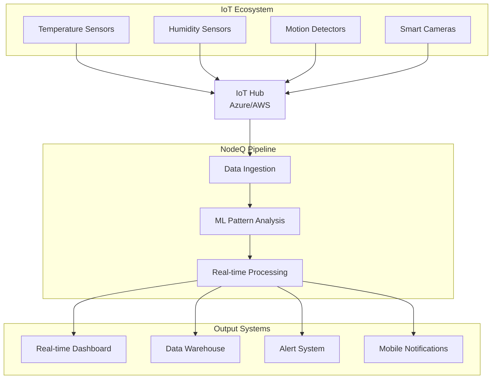
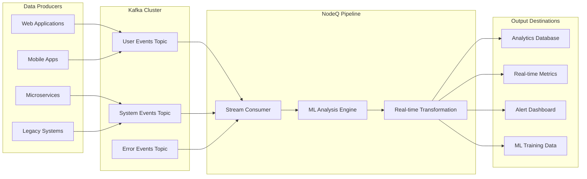
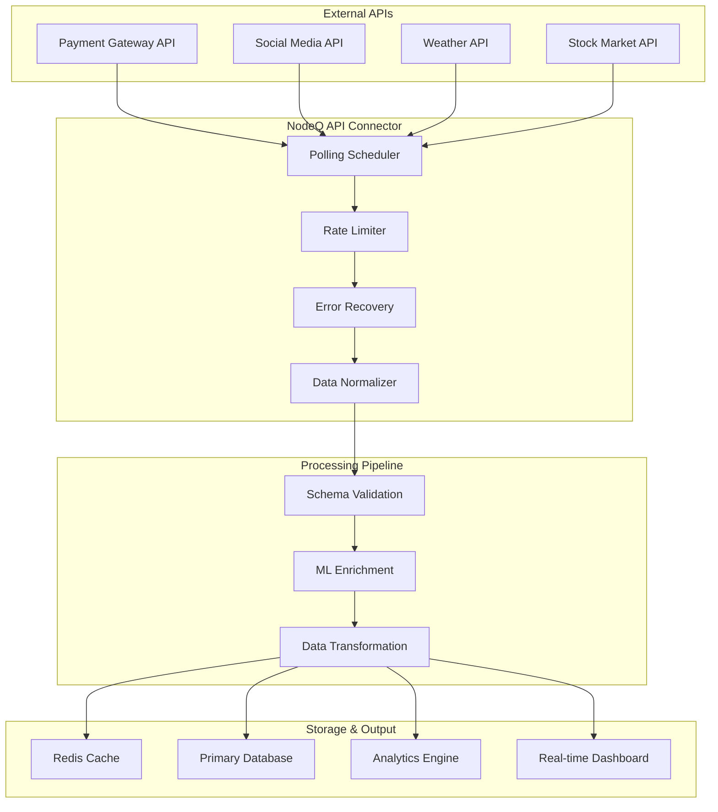
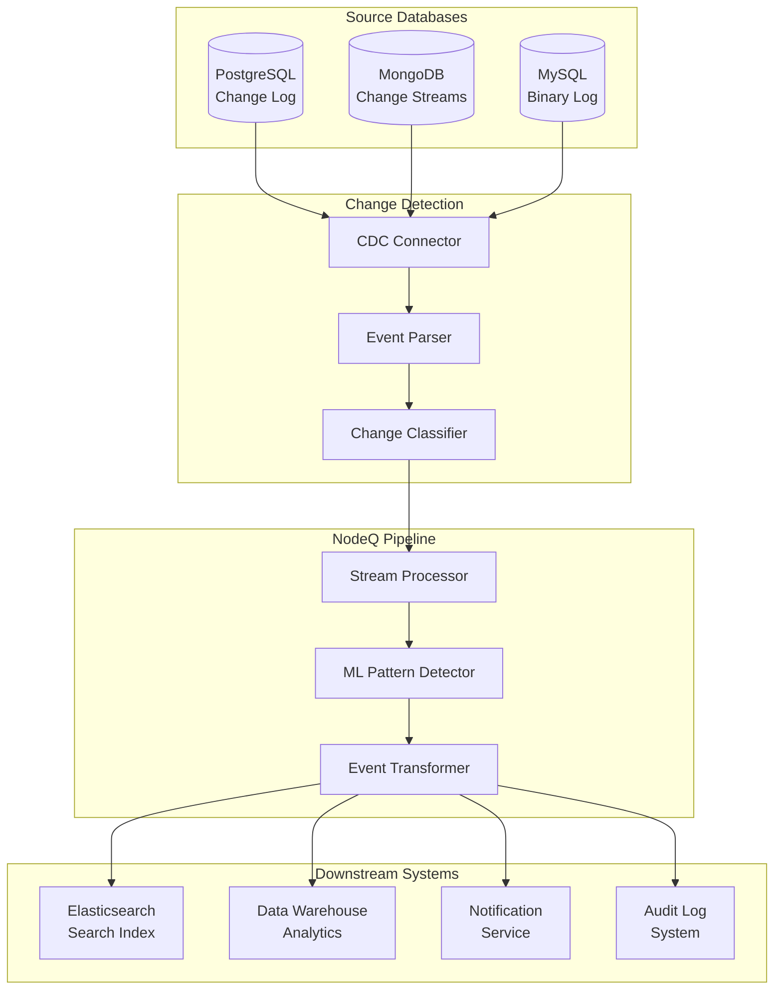
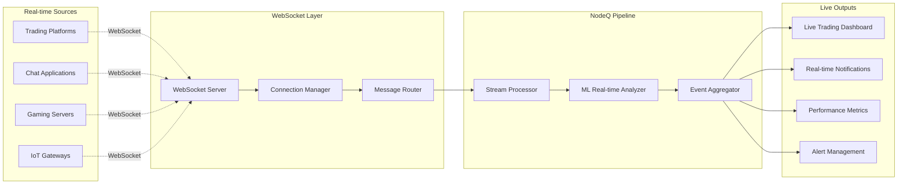

# Data Source Integration Guide

Complete guide for integrating real-time and batch data sources.

## Real-World Integration Examples

### 1. IoT Hub Integration



```javascript
const iotConfig = {
  type: 'iot-hub',
  connection: {
    host: 'your-iot-hub.azure-devices.net',
    credentials: {
      token: process.env.IOT_HUB_TOKEN
    }
  },
  polling: {
    interval: 1000,
    batchSize: 100
  }
};

const pipeline = await mindMap.createDataPipeline(
  'IoT Sensor Pipeline',
  {
    deviceId: 'sensor_001',
    temperature: 23.5,
    humidity: 45.2,
    timestamp: '2024-01-15T10:30:00Z'
  },
  {
    device: 'sensor_001',
    readings: {
      temp_celsius: 23.5,
      humidity_percent: 45.2
    },
    alert_level: 'normal',
    processed_at: '2024-01-15T10:30:01Z'
  },
  {
    dataSources: [iotConfig],
    etlOptions: {
      errorHandling: 'log',
      parallelProcessing: true
    }
  }
);

// Start real-time processing
await mindMap.startRealtimeProcessing();
```

### 2. Kafka Stream Processing



```javascript
const kafkaConfig = {
  type: 'kafka',
  connection: {
    host: 'localhost:9092',
    topic: 'user-events',
    credentials: {
      username: process.env.KAFKA_USERNAME,
      password: process.env.KAFKA_PASSWORD
    }
  },
  polling: {
    interval: 500,
    batchSize: 1000
  }
};

const pipeline = await mindMap.createDataPipeline(
  'User Event Stream',
  {
    userId: '12345',
    event: 'page_view',
    url: '/dashboard',
    timestamp: '2024-01-15T10:30:00Z',
    metadata: { browser: 'chrome', device: 'mobile' }
  },
  {
    user_id: '12345',
    action: 'page_view',
    page: '/dashboard',
    session_data: {
      browser: 'chrome',
      device_type: 'mobile',
      engagement_score: 0.75
    },
    processed_timestamp: '2024-01-15T10:30:01Z'
  },
  {
    dataSources: [kafkaConfig],
    modelConfig: { type: 'tensorflow' }
  }
);
```

### 3. REST API Integration



```javascript
const apiConfig = {
  type: 'rest-api',
  connection: {
    apiEndpoint: 'https://api.example.com/data',
    credentials: {
      token: 'Bearer ' + process.env.API_TOKEN
    }
  },
  polling: {
    interval: 30000, // Poll every 30 seconds
    batchSize: 50
  }
};

const pipeline = await mindMap.createDataPipeline(
  'External API Integration',
  {
    id: 1,
    name: 'John Doe',
    email: 'john@example.com',
    created_at: '2024-01-15T10:30:00Z'
  },
  {
    customer_id: 1,
    full_name: 'John Doe',
    contact_email: 'john@example.com',
    status: 'active',
    last_sync: '2024-01-15T10:30:01Z'
  },
  { dataSources: [apiConfig] }
);
```

### 4. Database Change Streams



```javascript
const dbConfig = {
  type: 'database',
  connection: {
    connectionString: process.env.DATABASE_URL,
    credentials: {
      username: process.env.DB_USERNAME,
      password: process.env.DB_PASSWORD
    }
  }
};

const pipeline = await mindMap.createDataPipeline(
  'Database CDC Pipeline',
  {
    operation: 'INSERT',
    table: 'users',
    data: {
      id: 123,
      email: 'new@example.com',
      created_at: '2024-01-15T10:30:00Z'
    }
  },
  {
    change_type: 'user_created',
    user_id: 123,
    email: 'new@example.com',
    should_send_welcome: true,
    index_for_search: true,
    created_timestamp: '2024-01-15T10:30:00Z'
  },
  { dataSources: [dbConfig] }
);
```

### 5. WebSocket Real-time Data



```javascript
const wsConfig = {
  type: 'websocket',
  connection: {
    host: 'wss://api.example.com/stream',
    credentials: {
      token: process.env.WS_TOKEN
    }
  }
};

const pipeline = await mindMap.createDataPipeline(
  'Live Trading Data',
  {
    symbol: 'BTC/USD',
    price: 45000.50,
    volume: 1.25,
    timestamp: '2024-01-15T10:30:00.123Z'
  },
  {
    trading_pair: 'BTC/USD',
    current_price: 45000.50,
    volume_24h: 1.25,
    price_change_percent: 2.5,
    trend: 'bullish',
    last_updated: '2024-01-15T10:30:00.123Z'
  },
  {
    dataSources: [wsConfig],
    etlOptions: {
      checkpointInterval: 100 // High frequency processing
    }
  }
);
```

## Configuration Reference

### ML Model Configurations

#### Built-in TensorFlow Model (Default)
```javascript
const mindMap = new NodeQMindMap({
  container: '#mindmap-container',
  data: {}
});

// Uses built-in TensorFlow.js model
const pipeline = await mindMap.createDataPipeline(
  'Default Pipeline',
  inputSample,
  outputSample
);
```

#### Custom TensorFlow Model
```javascript
const customModelConfig = {
  type: 'tensorflow',
  localPath: './models/custom-pipeline-model/model.json',
  parameters: {
    threshold: 0.8
  }
};

const pipeline = await mindMap.createDataPipeline(
  'Custom TF Pipeline',
  inputSample,
  outputSample,
  { modelConfig: customModelConfig }
);
```

#### Hugging Face Model Integration
```javascript
const hfModelConfig = {
  type: 'huggingface',
  modelName: 'sentence-transformers/all-MiniLM-L6-v2',
  endpoint: 'https://api-inference.huggingface.co/models/',
  apiKey: process.env.HF_API_TOKEN
};

const pipeline = await mindMap.createDataPipeline(
  'HF Semantic Pipeline',
  inputSample,
  outputSample,
  { modelConfig: hfModelConfig }
);
```

#### OpenAI GPT Integration
```javascript
const openaiConfig = {
  type: 'openai',
  modelName: 'gpt-4',
  apiKey: process.env.OPENAI_API_KEY,
  parameters: {
    temperature: 0.2,
    maxTokens: 1000
  }
};

const pipeline = await mindMap.createDataPipeline(
  'GPT-Powered Pipeline',
  inputSample,
  outputSample,
  { modelConfig: openaiConfig }
);
```

#### Custom API Model
```javascript
const customApiConfig = {
  type: 'custom',
  endpoint: 'https://your-ml-api.com/analyze',
  apiKey: process.env.CUSTOM_API_KEY,
  parameters: {
    analysisType: 'pipeline-generation',
    confidence: 0.9
  }
};

const pipeline = await mindMap.createDataPipeline(
  'Custom API Pipeline',
  inputSample,
  outputSample,
  { modelConfig: customApiConfig }
);
```

## Performance Optimization

### High-Throughput Configuration
```javascript
const highThroughputConfig = {
  dataSources: [kafkaConfig],
  etlOptions: {
    parallelProcessing: true,
    batchSize: 1000,
    checkpointInterval: 5000,
    errorHandling: 'continue',
    maxRetries: 3
  }
};
```

### Low-Latency Configuration
```javascript
const lowLatencyConfig = {
  dataSources: [wsConfig],
  etlOptions: {
    parallelProcessing: false,
    batchSize: 1,
    checkpointInterval: 1,
    errorHandling: 'fail-fast'
  }
};
```
